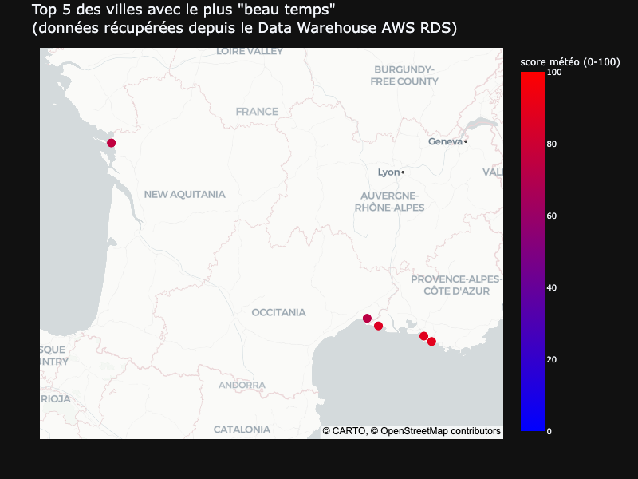
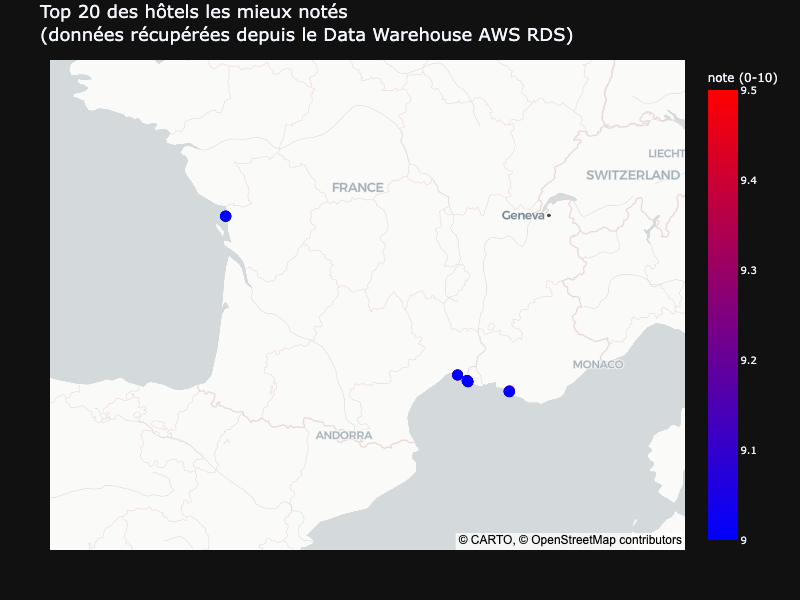

# Kayak — Recommander les meilleures destinations françaises à partir de données collectées


> Projet d'ingénierie de données · Certification CDSD, bloc 1 · Auteur : **Yoann ROBERT**

Pipeline de données *end-to-end* qui recommande les meilleures destinations françaises et les hôtels associés à partir de données réelles de météo et de Booking.com, depuis la collecte (API + scraping) jusqu'au Data Warehouse PostgreSQL via un Data Lake AWS S3.

## ⚠️ Avertissement légal

Ce projet est réalisé dans un cadre strictement pédagogique (certification Jedha). Les données sont scrapées à très petite échelle (100 hôtels) et stockées localement, sans aucune diffusion publique ni usage commercial. Booking.com interdit le scraping automatisé dans ses CGU et je suis conscient de cette limitation. Pour un usage en production, l'API officielle de Booking via leur programme partenaire serait la voie appropriée.

## Contexte & problématique

[Kayak](https://www.kayak.com) est un moteur de recherche de voyages fondé en 2004 et appartenant depuis 2013 à [Booking Holdings](https://www.bookingholdings.com/), qui détient également Booking.com. Son équipe marketing constate que **70 % des utilisateurs préparant un voyage souhaitent davantage d'informations sur leur destination**, et qu'ils accordent plus de crédit à un contenu produit par une marque qu'ils connaissent. **L'objectif du projet est de concevoir un pipeline qui recommande les meilleures destinations et les meilleurs hôtels à partir de données réelles**, à charge pour les équipes Data Analyse de l'exploiter ensuite.

Aucun jeu de données n'est fourni en entrée : il faut le constituer de toutes pièces à partir de sources publiques (API de géocodage, API météo, scraping de Booking.com), puis l'industrialiser dans un Data Lake et un Data Warehouse opérables.

## Sources & périmètre

|                 |                                                                                                                                                                          |
|-----------------|--------------------------------------------------------------------------------------------------------------------------------------------------------------------------|
| **Sources**     | API [Nominatim](https://nominatim.org/) (géocodage) · API [OpenWeather One Call 3.0](https://openweathermap.org/api/one-call-3) (prévisions) · Booking.com via [Scrapy](https://scrapy.org/) |
| **Périmètre**   | 35 villes françaises retenues par [One Week In.com](https://one-week-in.com/35-cities-to-visit-in-france/) comme les plus intéressantes à visiter                       |
| **Volume**      | 35 villes géocodées · 35 × 7 jours de prévisions journalières · 100 hôtels scrapés (20 hôtels × top 5 des villes)                                                       |
| **Stockage**    | Data Lake **AWS S3** (`eu-west-3`) · Data Warehouse **AWS RDS PostgreSQL** (`db.t4g.micro`, `eu-west-3`)                                                                 |
| **Livrables**   | CSV enrichi sur S3 · base PostgreSQL sur RDS · deux cartes interactives Plotly (top 5 destinations, top 20 hôtels)                                                       |

## Démarche

Le pipeline est conduit dans un notebook unique, en huit temps :

1. **Géocodage des 35 villes** via l'API Nominatim, dans le respect de la limite à 1 req/s. Une anomalie sur Mont Saint Michel (Nominatim renvoie une commune homonyme dans le Nord) est corrigée manuellement en préfixant le nom par "Le".
2. **Récupération des prévisions météo sur 7 jours** via OpenWeather One Call 3.0, en ne conservant que trois champs par jour : température ressentie à midi, probabilité de précipitations, volume de pluie attendu.
3. **Construction d'un score météo composite** combinant la proximité à une température cible (22 °C) et à un volume de pluie cible (0 mm), pour produire le top 5 des villes au plus beau temps.
4. **Scraping de Booking.com avec Scrapy** sur le top 5 des villes : nom, URL, coordonnées GPS, note utilisateurs et description des 20 premiers hôtels par ville. Le WAF AWS qui protège Booking est contourné en injectant les cookies (`aws-waf-token`…) d'une session navigateur valide.
5. **Ingestion dans le Data Lake S3** : envoi tel quel des cinq CSV bruts dans `raw_data/` du bucket dédié.
6. **Création du Data Warehouse RDS PostgreSQL** : cinq tables liées par clés étrangères, contraintes `NOT NULL` / `UNIQUE` / `ON DELETE CASCADE`, et index manuel sur les FK (PostgreSQL n'indexe pas automatiquement les clés étrangères).
7. **Pipeline ETL** : extraction depuis `raw_data/`, transformation (nettoyage, suppression des colonnes redondantes, préfixage `hotel_*` / `city_*`), double écriture vers `cleaned_data/` sur S3 *et* vers les tables RDS, avec contrôle post-insertion ligne à ligne.
8. **Validation finale** par requête SQL à quatre `INNER JOIN` sur les cinq tables : le résultat reconstitue exactement le top 20 enrichi obtenu en mémoire à l'issue de la Partie 4 et confirme l'intégrité du pipeline.

## Architecture

L'infrastructure s'articule autour de trois zones : la **collecte** (API externes interrogées depuis l'environnement local Python), le **stockage brut et nettoyé** sur S3 (Data Lake), et le **stockage relationnel** sur RDS PostgreSQL (Data Warehouse).

```
┌─────────────────────────────────────────────────────────────────┐
│                       SOURCES EXTERNES                          │
│  Nominatim API    OpenWeather API    Booking.com (via Scrapy)   │
└──────┬─────────────────┬──────────────────────┬─────────────────┘
       │                 │                      │
       ▼                 ▼                      ▼
┌─────────────────────────────────────────────────────────────────┐
│              ENVIRONNEMENT LOCAL (notebook Jupyter)             │
│           Python · pandas · requests · Scrapy · boto3           │
│                  Credentials : fichier .env                     │
└──────────────────────────────┬──────────────────────────────────┘
                               │
                               ▼
┌───────────────────────────────────────────┐    ┌───────────────────┐
│       AWS S3 — Data Lake (eu-west-3)      │    │   AWS RDS         │
│  Bucket : jedha-certif-...-projet-kayak   │───►│   PostgreSQL      │
│    ├── raw_data/      (ingestion)         │ETL │   (eu-west-3)     │
│    └── cleaned_data/  (post-transform)    │    │   db.t4g.micro    │
└───────────────────────────────────────────┘    │   5 tables liées  │
                                                 └───────────────────┘
```

**Région AWS.** `eu-west-3` (Paris) est retenue pour deux raisons : la latence minimale pour un projet réalisé et présenté en France, et la conformité RGPD en perspective d'une mise en production (les données collectées ici ne sont pas personnelles, mais celles d'utilisateurs Kayak en production le seraient).

**Classe d'instance RDS.** Une `db.t4g.micro` (ARM Graviton, 2 vCPU, 1 Go) éligible au free tier AWS la première année (750 h/mois incluses), très largement suffisante pour les ~200 lignes du projet.

**Coûts et cycle de vie.** L'ensemble tient dans le free tier la première année. Hors free tier, le coût d'exploitation continu serait d'environ **15 €/mois**, dominé par l'instance RDS allumée 24 h/24 (~12 €), le stockage RDS (2 à 3 €) et le stockage S3 (quelques centimes). L'instance RDS est supprimée à l'issue de la certification, les données nettoyées restant disponibles sur S3 et l'infrastructure reconstituable à la demande via le pipeline ETL.

## Principaux résultats

**Le pipeline fonctionne de bout en bout, de la collecte jusqu'à la base SQL relationnelle**, et les deux livrables interactifs demandés sont produits.

- **Top 5 des villes** sur les sept prochains jours, classées par score météo composite. La carte Plotly ci-dessous positionne les cinq villes retenues et matérialise leur score sur une échelle 0–100.



- **Top 20 des hôtels** parmi les 100 scrapés sur Booking.com (20 hôtels × 5 villes du top), classés par note utilisateurs. La carte Plotly ci-dessous les répartit géographiquement sur les villes du top 5.



- **Validation par requête SQL.** Une requête à quatre `INNER JOIN` sur les cinq tables du Data Warehouse restitue exactement le DataFrame final obtenu en mémoire à l'issue de la Partie 4 (top 20 enrichi des informations ville + score météo), confirmant la cohérence du pipeline complet :

```
  Parties 1 à 4         Partie 5              Partie 7                            Partie 8
 ───────────────       ──────────            ──────────                          ──────────

  Données brutes  ──► S3 raw_data/  ──► E : extraction depuis S3 raw_data/
   (en mémoire)                          │
                                         ▼
                                        T : nettoyage / transformation
                                         │
                                         ├──► L : S3 cleaned_data/
                                         │
                                         └──► L : tables AWS RDS         ──►    requête SQL
                                                                                de vérification
```

## Structure du projet

```
.
├── README.md
├── Kayak_Guidelines.md            # consignes données par Jedha
├── requirements.txt
├── .env.example                   # template ; le .env réel n'est pas versionné
├── booking_scraper/               # projet Scrapy de scraping Booking.com
│   ├── __init__.py
│   ├── items.py
│   ├── README.md
│   ├── scrapy.cfg
│   ├── settings.py
│   └── booking_scraper/
│       └── spiders/
│           ├── __init__.py
│           └── booking_spider.py
├── data/                          # CSV intermédiaires générés par le notebook
│                                  # (relancer le notebook pour créer le dossier et son contenu)
├── images/                        # captures Plotly + captures AWS S3 / RDS
└── notebooks/Kayak.ipynb          # pipeline complet, parties 1 à 8
```

## Installation & exécution

Prérequis :
- Python 3.13+
- Un compte AWS (pour S3 et RDS)
- Une clé API [openweathermap.org](https://openweathermap.org/appid) (gratuite, nécessite une inscription)

```bash
pip install -r requirements.txt
```

**Configuration des credentials.** Renseigner un fichier `.env` à la racine, sur le modèle de `.env.example`, contenant :

- `OPENWEATHERMAP_API_KEY` — clé OpenWeather One Call 3.0,
- `AWS_ACCESS_KEY_ID`, `AWS_SECRET_ACCESS_KEY` — utilisateur IAM avec droits S3,
- `AWS_RDS_INSTANCE_NAME`, `AWS_RDS_DB_NAME`, `AWS_RDS_USERNAME`, `AWS_RDS_PASSWORD`, `AWS_RDS_HOSTNAME`, `AWS_RDS_PORT` — paramètres de connexion à l'instance RDS.

**Étape supplémentaire indispensable pour le scraping Booking.com.** Booking est protégé par un WAF AWS qui bloque les requêtes Scrapy non validées par JavaScript. Avant d'exécuter la Partie 4, ouvrir une session sur [booking.com](https://www.booking.com) dans n'importe quel navigateur, puis récupérer la valeur du cookie `aws-waf-token` via les outils développeur du navigateur (F12 → onglet Application ou Stockage → Cookies) et l'injecter dans le spider Scrapy. **Ce cookie expire rapidement (quelques heures à 24 h) et doit être renouvelé manuellement** avant chaque nouvelle session de scraping.

Exécuter ensuite les cellules du notebook dans l'ordre. Le flag `FORCE_DOWNLOAD = True / False` en tête de notebook permet de re-télécharger les données ou de relire les CSV intermédiaires déjà présents.

## Limites

Résultats à lire avec prudence méthodologique et opérationnelle :

1. **Contournement du WAF par cookies, temporaire.** Les cookies `aws-waf-token` expirent et requièrent un renouvellement manuel. Pour un usage en production, l'API officielle de Booking via son programme partenaire serait la seule voie acceptable, le scraping étant interdit par les CGU.
2. **Score météo arbitraire.** La température cible (22 °C) et le volume de pluie cible (0 mm) reflètent une préférence personnelle pour une météo estivale sèche, pas une pondération objective. Une version production gagnerait à exposer ces seuils en paramètres utilisateur (été plage / hiver montagne / ville couverte…).
3. **Distance hôtel–ville non contrôlée.** Booking propose parfois des hôtels dans un rayon élargi autour de la ville recherchée. Un filtrage sur la distance géodésique entre les coordonnées de la ville et celles de l'hôtel serait pertinent pour exclure les hôtels manifestement hors zone.
4. **Périmètre de *proof of concept*.** Le volume est volontairement réduit (35 villes, 100 hôtels). Une montée en charge réelle (autres pays, plusieurs milliers d'hôtels) impliquerait de revoir la stratégie de scraping (parallélisation, rotation d'IP, gestion fine des erreurs et reprises) et de basculer les CSV vers un format colonnaire type Parquet.
5. **Sécurité RDS minimale.** Les paramètres par défaut de l'instance (Security Group `0.0.0.0/0`, pas de SSL/TLS forcé, pas de chiffrement au repos) sont acceptables en contexte pédagogique mais devraient être durcis en production (restriction IP, chiffrement en transit, chiffrement KMS au repos).

## Stack technique

Python · pandas · requests · Scrapy · boto3 · SQLAlchemy · python-dotenv · Plotly · AWS S3 · AWS RDS PostgreSQL
