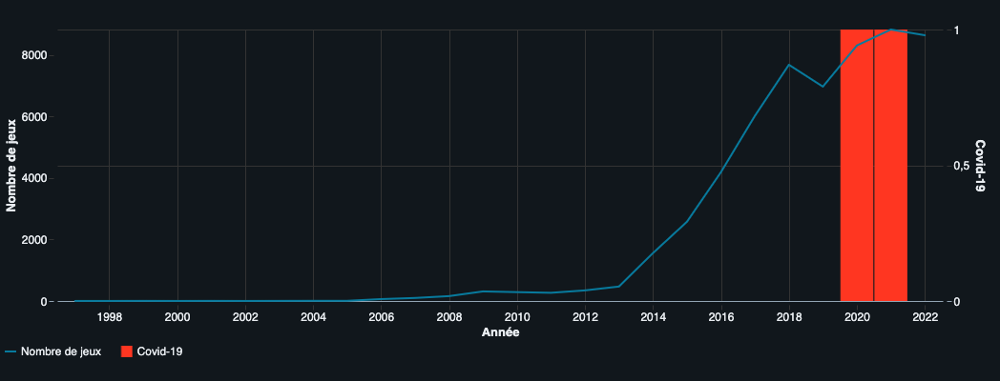
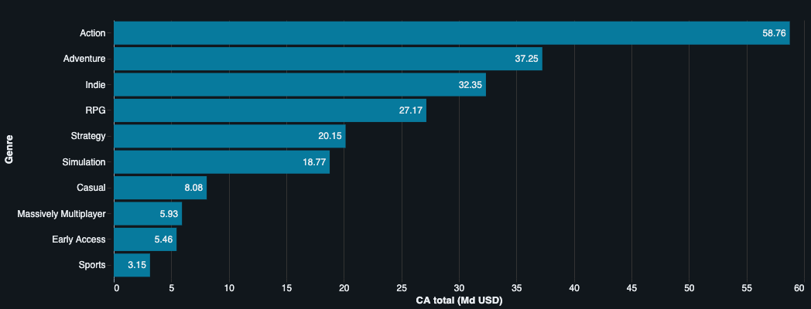
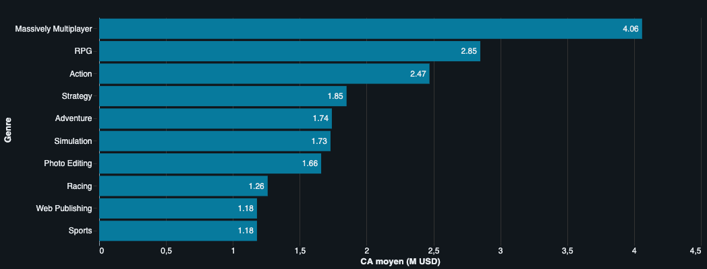
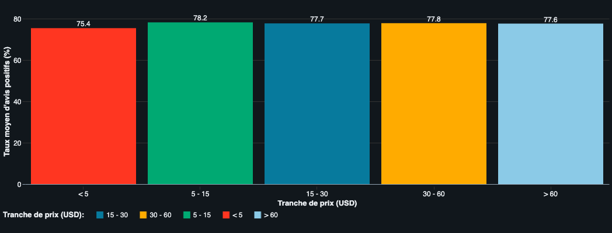
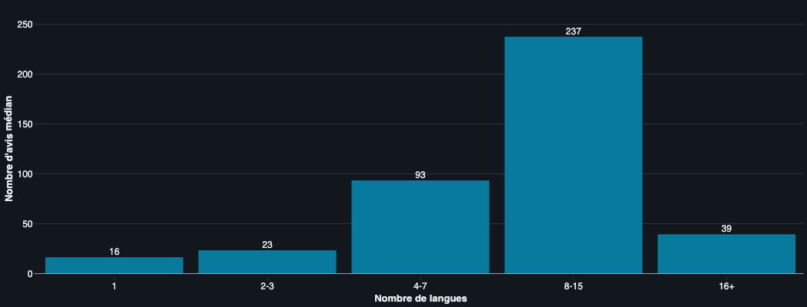
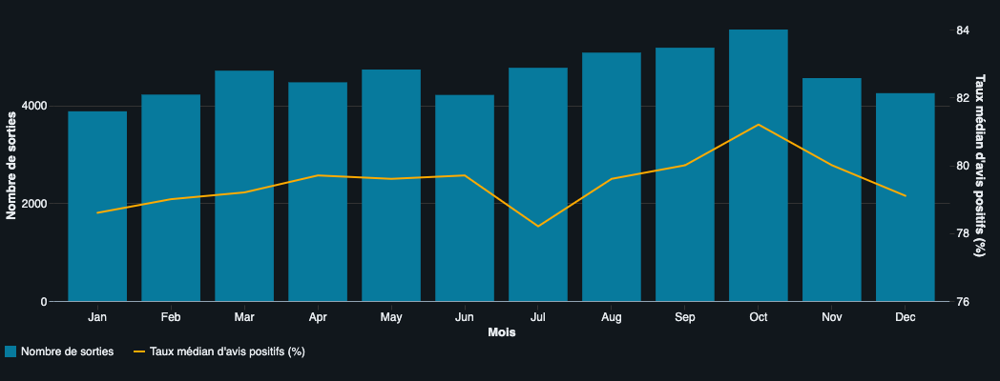

# Steam — Quels facteurs font le succès d'un jeu vidéo ?


> Projet d'analyse exploratoire (EDA) · Certification CDSD, bloc 2 · Auteur : **Yoann ROBERT**

Analyse globale du marché du jeu vidéo via le catalogue Steam pour identifier les leviers réels du succès d'un jeu, et écarter les fausses pistes, en vue du lancement d'un nouveau titre par Ubisoft.

## Contexte & problématique

Ubisoft, éditeur français de jeux vidéo, prépare le lancement d'un nouveau titre et souhaite mieux comprendre l'écosystème dans lequel il s'inscrira. Pour l'éclairer, le catalogue Steam, la plus grande plateforme de distribution numérique du marché PC, est analysé dans son ensemble. **L'objectif est d'identifier les facteurs qui influencent réellement la popularité et la rentabilité d'un jeu**, à l'écart des intuitions et des idées reçues, afin d'orienter les choix de positionnement, de tarification, de localisation, de timing et de plateforme.

## Données

|                 |                                                                                                                                                             |
|-----------------|-------------------------------------------------------------------------------------------------------------------------------------------------------------|
| **Source**      | Fichier JSON chargé depuis un bucket AWS S3 · [dataset](https://full-stack-bigdata-datasets.s3.amazonaws.com/Big_Data/Project_Steam/steam_game_output.json) |
| **Volume**      | ~55 600 jeux                                                                                                                                                |
| **Granularité** | Une ligne = un jeu, identifié par son `appid` Steam                                                                                                         |
| **Format**      | JSON semi-structuré, schéma imbriqué (`struct`/`array` sur plusieurs niveaux)                                                                               |

Le dataset s'arrête au 11 novembre 2022 (315ᵉ jour de l'année), point pris en compte dans les analyses temporelles via extrapolation explicite.

## Démarche

L'étude est conduite dans un notebook unique exécuté sur **Databricks** (Free Edition, *serverless compute*), en six temps :

1. **Nettoyage** : aplatissement du schéma imbriqué, conversion des types (prix en `DecimalType`, dates en `date`, âges en `int`), parsing du champ `owners` (intervalle ramené à la moyenne), éclatement des langues et des genres en `array<string>`, calcul du ratio d'avis positifs.
2. **Analyse macroscopique** : éditeurs les plus prolifiques, jeux les mieux notés, évolution annuelle des sorties (effet Covid), distribution des prix et des remises, langues les plus représentées, restrictions d'âge.
3. **Analyse par genre** : représentation, qualité de réception, identités éditoriales (genres favoris des top 10 éditeurs), rentabilité (CA total et CA moyen par jeu).
4. **Analyse par plateforme** : couverture Windows / Mac / Linux, préférences de plateforme par genre.
5. **Croisements complémentaires** : prix × satisfaction × popularité, auto-édition vs éditeur tiers, effort de localisation, saisonnalité mensuelle et dates "maudites".
6. **Synthèse et recommandations** opérationnelles à Ubisoft.

## Principaux résultats

**Le constat central : Steam est un marché mature et saturé, où le succès ne se joue pas sur le prix.** Après une croissance explosive (×16 entre 2013 et 2018), le rythme de publication ralentit nettement dès 2019, indépendamment du Covid. Le catalogue arrive à maturité et la rareté de l'attention devient le facteur limitant. Ce n'est pas le cas du tarif.



En réponse aux questions directrices du sujet :

- **Quels sont les genres les plus rémunérateurs ?** La réponse dépend de la métrique. En **CA total**, **l'action écrase le classement avec 58,8 Md USD** grâce au volume, devant l'aventure (37,3) et l'indie (32,4). En **CA moyen par jeu**, le classement bascule : le **Massively Multiplayer (4,06 M USD)** et le **RPG (2,85 M USD)** passent en tête, l'action retombant à 2,47. L'action reste l'arbitrage de fond pour Ubisoft (volume + savoir-faire AAA déjà installé), une composante RPG offrant le levier de rentabilité unitaire qui lui manque.




- **Le prix d'un jeu influence-t-il sa réception ?** Non. La corrélation de Pearson entre prix et taux d'avis positifs est quasi nulle (**0,0375**), et le taux moyen reste compris entre **75,4% et 78,2%** sur toutes les tranches de prix, soit moins de 3 points d'amplitude. Le marché est déjà calé sur les bas prix (médiane ≈ 5 USD, Q3 = 10 USD) et baisser encore n'apporte rien. Tout euro investi dans une remise est un euro retiré de la qualité perçue.



- **L'effort de localisation paie-t-il en visibilité ?** Oui, mais jusqu'à un seuil. Le jeu médian monolingue cumule 16 avis. Il en cumule **237 entre 8 et 15 langues, soit un facteur 15**. Au-delà de 16 langues, l'audience médiane s'effondre à 39 : sur-localiser devient un gaspillage. Il existe donc une **fenêtre optimale de localisation** que le notebook calibre à 8-15 langues, à prioriser sur les marchés les plus représentés (EN, DE, FR, RU, ZH simplifié, ES, JA).



- **Y a-t-il une fenêtre de sortie privilégiée ?** Oui. Le pic est en **octobre (5 549 sorties)** et c'est aussi le mois à la meilleure note médiane (81,2%). Le creux est en janvier (3 877), soit ~43% d'écart avec octobre. Contre-intuitif : **décembre est sous la moyenne** (4 248 sorties). Les éditeurs sortent leurs jeux *avant* la période d'achats de fin d'année, pas pendant. La fenêtre 23-31 décembre s'effondre à un tiers de la normale, sous l'effet conjoint des fêtes et des soldes d'hiver Steam qui captent toute l'attention. À prendre avec le sourire : il n'existe pas de date "maudite" par superstition (le 1er avril et Halloween sont au-dessus de la moyenne), seulement une **malédiction logistique** bien réelle.



- **Quelle est la plateforme dominante ?** Windows écrase le marché à **99,97%** de couverture. Mac suit loin derrière (22,93%), Linux reste marginal (15,19%). Tous les genres sont disponibles sur Windows à plus de 98,9% : la plateforme n'est pas un facteur discriminant. Lorsqu'un portage est envisagé, Mac est systématiquement privilégié face à Linux (~60/40), avec une orientation encore plus marquée pour les genres créatifs (Audio Production, Video Production, Photo Editing).

- **L'éditeur tiers apporte-t-il un gain de qualité ?** Non, mais un gain de visibilité massif. Les jeux auto-édités et ceux portés par un éditeur tiers obtiennent des taux d'avis positifs quasi identiques (73,0% vs 74,5%). En revanche, le jeu médian sous éditeur tiers cumule **54 avis contre 20 en auto-édition (×2,7)**. La force d'un éditeur établi se mesure en distribution, pas en polish. Pour Ubisoft, c'est un avantage structurel face aux 68% de jeux auto-édités du catalogue.

## Recommandations pour Ubisoft

- **Capitaliser sur le genre action, intégrer une forte composante RPG** pour la rentabilité unitaire. L'action est le terrain le plus rentable en volume et au cœur du savoir-faire Ubisoft, le RPG y ajoute le levier individuel (2,85 M USD / jeu).
- **Différencier par la qualité perçue, jamais par le prix**. La satisfaction est indépendante du prix : tout euro de remise est perdu, il doit être réalloué au polish, au contenu et à la finition.
- **Calibrer la localisation entre 8 et 15 langues** (priorité EN, DE, FR, RU, ZH, ES, JA). L'audience médiane est multipliée par 15 dans cette tranche, au-delà le rendement s'effondre.
- **Verrouiller une fenêtre de sortie en septembre-octobre**, proscrire le 23-31 décembre et le creux de janvier. La contrainte est logistique, pas symbolique : on ne sort pas un jeu quand les soldes Steam captent toute l'attention.
- **Concentrer le développement sur Windows, étendre à Mac et exploiter la force de distribution Ubisoft**. Windows est incontournable (99,97%), Mac est le seul portage secondaire au rendement justifiable, Linux reste réservé à des cas ciblés. Surtout, la puissance marketing et communautaire d'Ubisoft est l'avantage structurel le plus différenciant face aux 68% de jeux auto-édités du marché.

## Structure du projet

```
.
├── html/                      # export HTML du notebook et du dashboard de synthèse
├── images/                    # visualisations exportées (PNG)
├── notebooks/Steam.ipynb      # analyse PySpark complète et interprétations
├── README.md                  # ce fichier
└── Steam_guidelines.md        # consignes données par Jedha
```

> Les chemins d'images de ce README (`images/...`) supposent que `images/` est à la racine du projet et que le notebook est dans un sous-dossier `notebooks/`. Ajustez les liens si votre arborescence diffère.

## Exécution

Pour faciliter la consultation par le jury, deux exports HTML ont été produits depuis le notebook `Steam.ipynb` : l'analyse complète d'une part, la vue dashboard de synthèse d'autre part. Les visualisations y sont intégrées. Deux options sont proposées :

- **Consultation directe (recommandée)** : télécharger les fichiers `html/Steam.html` (analyse complète) et `html/Steam_dashboard.html` (dashboard de synthèse) depuis le dépôt, puis les ouvrir avec un navigateur Internet. Aucune installation n'est requise.
- **Import dans un workspace Databricks personnel** : importer dans son workspace Databricks (Free Edition suffisante) soit la version native `notebooks/Steam.ipynb`, soit son export HTML `html/Steam.html`. Attacher ensuite le notebook à un compute *serverless* ou à un cluster classique, puis exécuter les cellules dans l'ordre. Aucune dépendance externe n'est à installer : le notebook s'appuie uniquement sur `pyspark.sql.functions` et `pyspark.sql.types`, et lit le dataset directement depuis le bucket S3 public.

> Le notebook tourne sur Databricks Free Edition (*serverless compute*), qui n'autorise pas la mise en cache explicite des DataFrames (`cache()` et `persist()` lèvent une exception). L'environnement gère son propre cache de manière transparente. Le volume traité (~55 000 lignes) ne justifie pas la matérialisation en tables Delta.

## Limites

Résultats à lire avec prudence méthodologique :

1. **`owners` est un intervalle** (ex. `[20 000 ; 50 000]`), ramené à sa moyenne. L'incertitude est forte au niveau d'un jeu donné mais se lisse par agrégation.
2. **Le chiffre d'affaires est un proxy d'ordre de grandeur** (`price_USD × owners`). Il **surestime** les jeux payants (intègre les copies offertes, bundles, fortes promotions) et **sous-estime fortement les modèles free-to-play** (MMO, *Free to Play*) dont les revenus passent par les microtransactions, non capturées par `price_USD`. Utile pour classer les genres entre eux à méthode constante, pas pour évaluer un montant absolu.
3. **Multi-genre** : un jeu portant N genres est compté N fois dans les agrégations par genre, ce qui gonfle artificiellement CA total et CA moyen. Le classement relatif des genres reste valide, les valeurs absolues sont à pondérer.
4. **Restrictions d'âge inexploitables** : 98,8% des jeux n'ont aucun âge minimum renseigné. Steam ne semble pas imposer ce champ, ce qui empêche toute analyse fine des PEGI.
5. **Dataset arrêté au 11 novembre 2022** (315ᵉ jour). L'année 2022 a été extrapolée par `× 365 / 315` pour comparaison. Cette extrapolation surestime légèrement le total réel puisque le pic d'octobre est capté tandis que le creux de décembre ne l'est pas.
6. **Causalité non démontrable en EDA** : les corrélations observées (langues / visibilité notamment) ne distinguent pas la cause de l'effet. On traduit souvent un jeu en multiples langues *parce qu'on anticipe* son succès. Les recommandations sont donc des hypothèses de travail, à valider par A/B test en production par exemple.

## Stack technique

PySpark · Databricks (Free Edition, *serverless compute*) · Databricks Visualizations (graphiques natifs du notebook) · SQL (`pyspark.sql.functions`, `pyspark.sql.types`)
