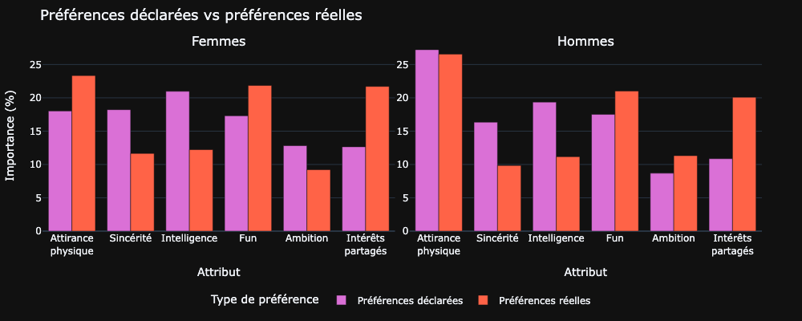
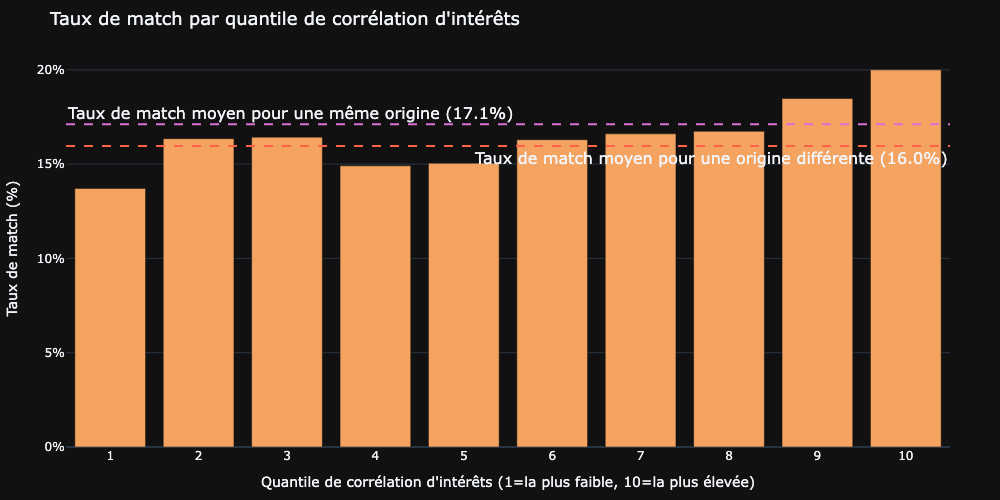
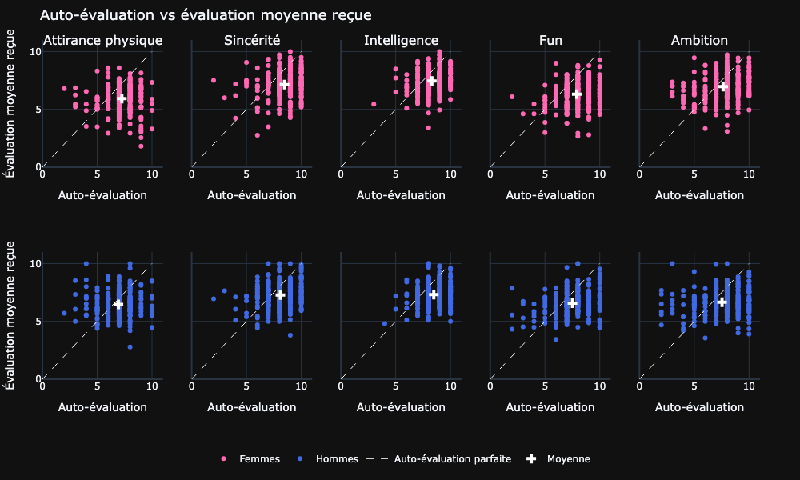

# Speed Dating avec Tinder — Qu'est-ce qui pousse deux personnes à se revoir ?


> Projet d'analyse exploratoire (EDA) · Certification CDSD, bloc 2 · Auteur : **Yoann ROBERT**

Analyse des données d'une campagne expérimentale de speed dating pour comprendre ce qui amène réellement deux personnes à vouloir un second rendez-vous et l'écart entre ce que les gens *disent* rechercher et ce qui motive *réellement* leurs décisions.

## Contexte & problématique

L'équipe Marketing de Tinder observe une baisse du nombre de matchs et cherche à comprendre ce qui attire une personne chez une autre. Pour l'éclairer, une campagne de speed dating a été menée : à chaque rencontre de quatre minutes, chaque participant note son partenaire sur six attributs (attirance physique, sincérité, intelligence, *fun*, ambition, intérêts partagés) et décide secrètement s'il souhaite le revoir. **L'objectif de l'étude est de relier ces données à la décision d'aller à un second date.**

## Données

| | |
|---|---|
| **Source** | Expériences de speed dating, Columbia University, 2002–2004 · [dataset CSV](https://full-stack-assets.s3.eu-west-3.amazonaws.com/M03-EDA/Speed+Dating+Data.csv) · [dictionnaire des variables](https://full-stack-assets.s3.eu-west-3.amazonaws.com/M03-EDA/Speed+Dating+Data+Key.doc) |
| **Volume** | 8 378 rencontres × 195 variables |
| **Granularité** | Une ligne = un speed date entre deux personnes |
| **Population** | 551 participants distincts (274 femmes, 277 hommes), ~26 ans en moyenne |

Le questionnaire est rempli en quatre temps (inscription, mi-soirée, lendemain, 3–4 semaines après), ce qui structure le suffixe des variables.

## Démarche

L'étude est conduite dans un notebook unique, en six temps :

1. **Évaluation de la qualité des données** : valeurs manquantes, valeurs aberrantes, harmonisation des échelles de notation hétérogènes (notes 1–10 vs répartition de 100 points) ; aucune suppression globale, traitement ciblé au cas par cas.
2. **Participants** : démographie, objectifs, importance déclarée de l'origine et de la religion.
3. **Facteurs déclarés** de l'attirance : préférences annoncées et représentations du sexe opposé.
4. **Facteurs réels** de l'attirance : corrélation des attributs avec la décision et le match (avec contrôle de l'effet de halo).
5. **Facteurs contextuels** : intérêts partagés vs origine, position dans la soirée, choix limité, différence d'âge.
6. **Auto-perception** : auto-évaluation vs évaluations reçues, et calibration de la confiance.

## Principaux résultats

**Le constat central : le discours ne prédit pas la décision.** En déclaratif, les femmes mettent en avant l'intelligence, les hommes l'attirance physique. Mais une fois confrontées aux décisions réelles, ces préférences s'effacent au profit d'un **trio commun aux deux genres : attirance physique, *fun*, intérêts partagés**. L'intelligence, la sincérité et l'ambition ne jouent qu'un rôle marginal. Chez les femmes, le bouleversement est spectaculaire : l'intelligence chute du 1ᵉʳ au 4ᵉ rang.



En réponse aux questions directrices du sujet :

- **Attributs les moins désirables ?** Pour la décision réelle, *sincérité*, *intelligence* et *ambition* forment le trio perdant systématique, quasi identique chez les hommes et les femmes (différences faibles, ≤ 3,3 points).
- **Attirance physique : perçue vs réelle ?** Les deux genres surestiment son importance pour le sexe opposé (+7 à +8 points). Elle est bien le premier déclencheur du « oui », mais pour le **match**, le *fun* passe devant elle.
- **Intérêts partagés vs même origine ?** Les intérêts l'emportent nettement : une corrélation des centres d'intérêt > 0,59 fait monter le taux de match à **20 %**. Le partage de l'origine n'apporte qu'un faible écart moyen (+1,1 point) qui **se dissout dès qu'on contrôle pour les intérêts** : ce n'est pas un levier indépendant.



- **Les gens prédisent-ils bien leur propre valeur ?** Non. Tous se surévaluent (+11,5 % pour les femmes, +8,5 % pour les hommes, soit ~1 point sur 10) et surestiment leurs chances de recevoir un « oui » : c'est le biais plus marqué chez les hommes (confiants à 100 %, ils reçoivent 59 « oui » sur 100, contre 76 pour les femmes).



- **Premier ou dernier date de la soirée ?** Quasiment sans effet sur l'obtention d'un second date : le taux de celui-ci reste autour de 38 % quelle que soit la position. En revanche, **restreindre le choix** (≤ 10 partenaires) augmente le taux de « oui » de ~5 points et le match de ~4,5 points, et une **faible différence d'âge** (0–2 ans, homme légèrement plus âgé) maximise la réciprocité.

## Recommandations pour Tinder

- Prioriser la qualité des photos et éléments visuels du profil (l'attirance reste le premier déclencheur).
- Faire émerger la personnalité « fun » via des formats courts (vidéos/photos en situation) plutôt que des biographies longues.
- Renforcer le matching sur les **centres d'intérêt partagés**, levier plus robuste que les critères socio-démographiques.
- Limiter le nombre de profils proposés par session pour contrer le paradoxe du choix.

## Structure du projet

```
.
├── README.md
├── requirements.txt
├── images/                  # 22 visualisations exportées (PNG)
└── notebooks/Tinder.ipynb   # analyse complète, statistiques et interprétations
```

> Les chemins d'images de ce README (`images/...`) supposent que `images/` est à la racine du projet et que le notebook est dans un sous-dossier (cohérent avec `IMG_DIR = "../images"` dans le notebook). Ajustez les liens si votre arborescence diffère.

## Installation & exécution

```bash
pip install -r requirements.txt
```

**Étape supplémentaire indispensable pour l'export des images.** Après l'installation des dépendances, exécutez la commande suivante pour installer une version embarquée du navigateur Chrome/Chromium pour le bon fonctionnement de `kaleido` :

```bash
kaleido_get_chrome      # ou, de façon équivalente : plotly_get_chrome
```

Sans cette étape, tout appel à `fig.write_image(...)` / `fig.to_image(...)` échouera avec une erreur du type `Kaleido requires Google Chrome to be installed`. Le notebook fonctionne aussi en mode purement interactif (figures Plotly) sans cette étape, mais la régénération des PNG la nécessite.

## Limites

Résultats à lire avec prudence méthodologique :
1. Données de 2002–2004 sur des étudiants de Columbia, en rencontre physique de 4 minutes. Contexte distinct de Tinder en 2026 (population mondiale, rencontre asynchrone par image).
2. Un **effet de halo** marqué (corrélations inter-attributs de 0,36 à 0,66) fait que les corrélations marginales captent une part d'appréciation globale du partenaire.
3. L'écart auto-évaluation / évaluation reçue combine un vrai biais de perception et un effet de contexte de notation. Les recommandations sont des hypothèses de travail à valider par A/B test en production.

## Stack technique

Python · pandas · NumPy · Plotly · statsmodels (lissage LOWESS) · Kaleido (export statique)
