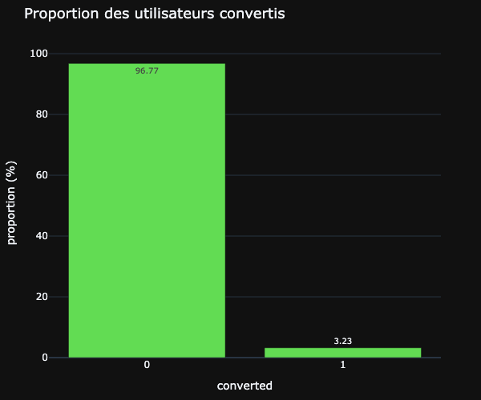
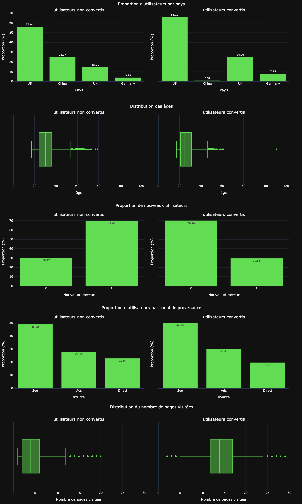
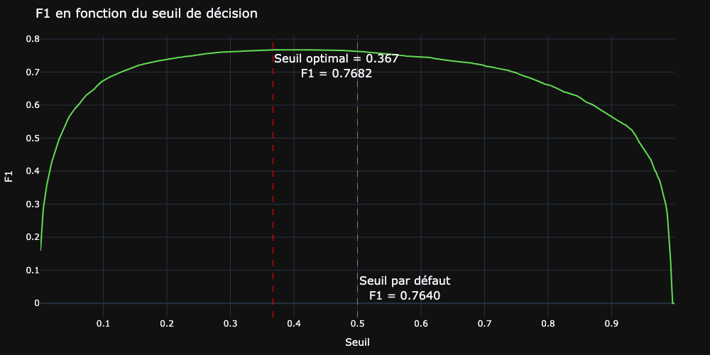
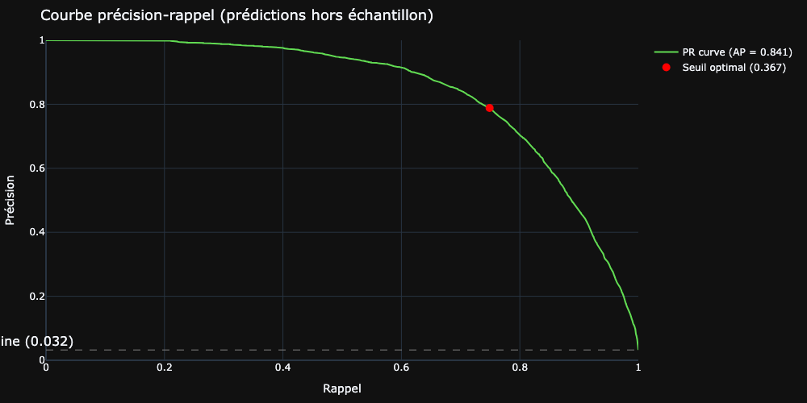
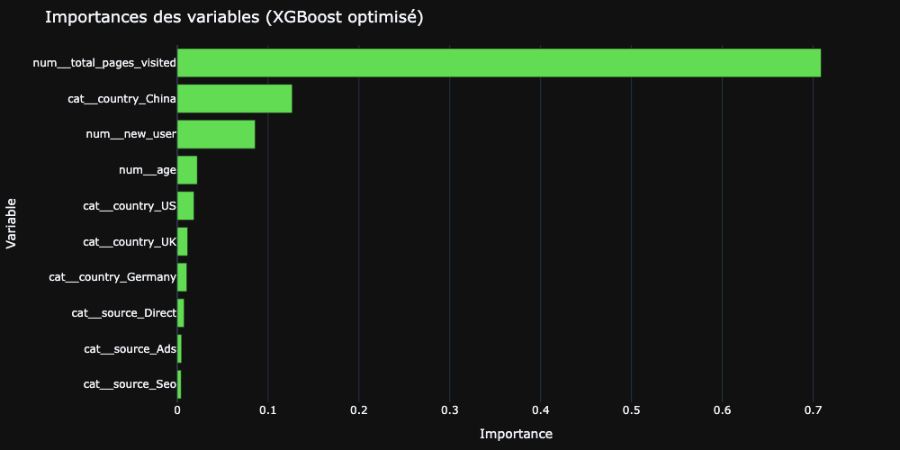

# Conversion rate challenge : prédire l'inscription à une newsletter


> Projet de machine learning supervisé · Certification CDSD, bloc 3 · Auteur : **Yoann ROBERT**

Modèle de classification qui prédit si un visiteur du site de la newsletter Data Science Weekly va s'abonner, 
sur un jeu fortement déséquilibré (3,23% de conversions), avec construction d'un pipeline scikit-learn complet, 
comparaison de plusieurs modèles, optimisation du F1-score et du seuil de décision, et analyse des leviers de conversion.

## Contexte et problématique

[Data Science Weekly](https://www.datascienceweekly.org) est une newsletter indépendante éditée par des data scientists, 
à laquelle les utilisateurs peuvent s'inscrire librement depuis le site. L'équipe qui l'anime souhaite mieux comprendre 
le comportement des visiteurs et identifier les facteurs qui influencent leur décision de s'abonner. 
**L'objectif est double : construire un modèle qui prédit la conversion d'un utilisateur à partir de quelques informations, 
et analyser les paramètres de ce modèle pour dégager des leviers concrets susceptibles d'améliorer le taux d'abonnement.**

Le projet prend la forme d'une compétition de machine learning. Les données sont fournies en deux fichiers 
(un jeu étiqueté pour l'entraînement, un jeu sans étiquettes pour la soumission), dans le format usuel de ce type d'exercice. 
La métrique d'évaluation est imposée : le F1-score sur la classe positive, approprié au caractère déséquilibré du problème 
et à l'enjeu d'identification correcte des futurs convertis.

## Données

|                 |                                                                                                                                 |
|-----------------|---------------------------------------------------------------------------------------------------------------------------------|
| **Source**      | Fichiers CSV hébergés sur AWS S3, fournis par Jedha                                                                             |
| **Volume**      | 284 580 lignes étiquetées (entraînement) et 31 620 lignes sans étiquettes (soumission)                                          |
| **Granularité** | Une ligne = un utilisateur ayant visité le site                                                                                 |
| **Variables**   | `country`, `age`, `new_user`, `source` (canal de provenance), `total_pages_visited`, et la cible `converted`                    |
| **Cible**       | `converted` (inscription ou non à la newsletter), positive dans seulement 3,23% des cas, soit un déséquilibre de classes marqué |

## Démarche

L'étude est conduite dans un notebook unique, en six temps :

1. **Analyse exploratoire (EDA)** :
analyses univariée et bivariée des cinq variables, matrices de corrélation, test d'interaction entre variables, 
et caractérisation du déséquilibre de classes qui dicte le choix de la métrique.
2. **Préparation des données** : 
split train/test stratifié sur la cible, *custom transformer* `FeatureEngineer` (plafonnement de l'âge, 
binarisation du pays, transformation logarithmique du nombre de pages), `ColumnTransformer` (standardisation des 
variables numériques, encodage one-hot des catégorielles) et assemblage d'un `Pipeline` scikit-learn complet.
3. **Comparaison de modèles** : 
évaluation par validation croisée stratifiée à 5 plis de trois candidats (régression logistique multivariée, 
forêt aléatoire, XGBoost) face à la baseline univariée, à chaîne de prétraitement et métrique identiques.
4. **Optimisation** : 
recherche d'hyperparamètres par `GridSearchCV` pour la régression logistique et par `RandomizedSearchCV` pour XGBoost, 
sélection du finaliste, puis calibration du seuil de décision pour maximiser le F1, 
encapsulée dans un wrapper `ThresholdClassifier` compatible scikit-learn.
5. **Analyse du modèle** : 
lecture croisée des coefficients de la régression logistique (sens et intensité des effets) et des importances de 
variables de XGBoost (hiérarchie), pour traduire le modèle en leviers métier.
6. **Inférence et soumission** : 
réentraînement du pipeline finaliste sur l'ensemble des données étiquetées, prédiction sur le jeu sans étiquettes, 
export au format de soumission et sauvegarde des artefacts du modèle au format `joblib`.

## Principaux résultats

**Le constat central : un problème simple en apparence, mais piégé par un déséquilibre de classes sévère.** 
Avec seulement 3,23% de conversions, un modèle naïf prédisant systématiquement "non converti" atteindrait déjà près 
de 97% d'accuracy sans aucune utilité. Le F1-score sur la classe positive est donc la seule métrique pertinente, 
et toute la modélisation est organisée autour de la classe minoritaire : stratification, validation croisée, 
et surtout optimisation du seuil de décision.



- **Quelles variables séparent les convertis des autres ?** Le nombre de pages visitées domine très largement 
- (corrélation de Pearson de 0,53 avec la cible, médiane de 14 pages chez les convertis contre 4 chez les non convertis). 
- Viennent ensuite trois effets modérés et négatifs : les utilisateurs chinois sous-convertissent massivement 
- (24,3% du trafic, mais à peine 1% des convertis), les nouveaux visiteurs convertissent quatre à cinq fois moins que 
- les récurrents, et les convertis sont plus jeunes (médiane 25 ans contre 30). 
Le canal de provenance (SEO, Ads, Direct) n'apporte quasiment aucun signal.



- **Quel modèle, et pourquoi ?** Les trois candidats dépassent la baseline univariée (F1 de 0,6924) de 5 à 7 points. 
- La hiérarchie est contre-intuitive : la régression logistique multivariée arrive en tête des modèles par défaut, 
- devant XGBoost. La structure du problème est en effet largement linéaire, ce que la sigmoïde capture naturellement. 
- Après optimisation, les deux finalistes deviennent indissociables (écart de 0,0012 en F1). 
- XGBoost est retenu pour la production, la régression logistique étant conservée comme modèle d'interprétation.

- **Le seuil de décision par défaut n'est presque jamais optimal sur un problème déséquilibré.** 
En balayant tous les seuils sur des prédictions hors échantillon, l'optimum se situe à 0,367, nettement sous le seuil 
par défaut de 0,5. Cet abaissement échange environ 6 points de précision contre 5 points de rappel, un compromis 
légèrement gagnant pour le F1.



- **La performance finale sur la classe minoritaire est solide.** 
La courbe précision-rappel, adaptée aux problèmes déséquilibrés, donne une Average Precision de 0,841, 
soit 26 fois le taux de base d'un classifieur aléatoire.
Au seuil retenu, le modèle obtient une précision de 0,79 pour un rappel de 0,75.
Évalué sur le jeu de test mis de côté, le modèle final atteint un F1 de 0,7715, légèrement supérieur à l'estimation par 
validation croisée, ce qui confirme l'absence de sur-apprentissage.



La progression du F1 résume l'apport de chaque étape, l'essentiel du gain venant du passage au modèle multivarié :

| Étape                                                           | F1         |
|-----------------------------------------------------------------|------------|
| Baseline (régression logistique univariée)                      | 0,6924     |
| Meilleur modèle candidat par défaut (régression logistique)     | 0,7615     |
| Optimisation des hyperparamètres (XGBoost)                      | 0,7639     |
| Optimisation du seuil de décision                               | 0,7682     |
| **Évaluation finale sur le jeu de test**                        | **0,7715** |

- **Les deux modèles convergent sur la même hiérarchie de variables.** 
Pour le modèle de production, les importances de XGBoost concentrent la quasi-totalité du signal sur trois variables : 
`total_pages_visited` (71% du gain d'information), `country_China` (13%) et `new_user` (9%). 
Ces importances donnent l'intensité de l'effet, mais pas son sens. La régression logistique, conservée comme modèle 
d'interprétation, le complète : son coefficient est nettement positif pour `total_pages_visited` (+4,67) et négatif 
pour `country_China` (-3,28), `new_user` et `age`, tandis que la régularisation L1 annule complètement `country_UK` et 
`source_Ads`. 
Que deux modèles aux mécanismes très différents aboutissent à la même hiérarchie en renforce la robustesse.



## Recommandations pour Data Science Weekly

Quatre leviers ressortent de l'analyse, classés par potentiel d'impact estimé.

- **Investiguer la sous-conversion chinoise.** 
Les utilisateurs chinois représentent 24% du trafic, mais 1% des conversions : c'est le levier au plus fort potentiel. 
Pistes côté produit : qualité de la traduction, latence d'accès depuis la Chine, compatibilité des moyens de paiement 
locaux, blocage des services tiers d'authentification.
- **Renforcer la rétention plutôt que l'acquisition.** 
Les utilisateurs récurrents convertissent bien mieux que les nouveaux visiteurs. 
Des dispositifs de réengagement seraient probablement plus rentables qu'une hausse pure du budget d'acquisition.
- **Cibler les segments démographiques jeunes.** 
Les convertis ont une médiane d'âge de 25 ans contre 30 pour les non convertis : les campagnes peuvent ajuster leur 
ciblage sans changer la stratégie globale.
- **Rationaliser l'allocation entre canaux d'acquisition.** 
Le canal de provenance n'apporte aucun signal de conversion. 
Le budget peut être réparti selon le seul coût d'acquisition unitaire, sans craindre d'impact sur la qualité des 
conversions.

## Structure du projet

```
.
├── README.md
├── Conversion_rate_challenge_Guidelines.md     # consignes données par Jedha
├── requirements.txt
├── images/                                     # visualisations exportées (PNG)
├── submissions/                                # fichier de prédictions et artefacts du modèle
└── notebooks/Conversion_rate_challenge.ipynb   # notebook complet, parties 1 à 6
```

## Installation et exécution

Prérequis :
- Python 3.13+

```bash
pip install -r requirements.txt
```

Les jeux de données sont lus directement depuis leurs URL publiques sur AWS S3, 
aucun téléchargement manuel ni credential n'est nécessaire. 
Il suffit d'ouvrir le notebook et d'exécuter les cellules dans l'ordre.

Deux drapeaux en tête de notebook contrôlent les sorties : 
`SHOW_INTERACTIVE_FIG` affiche les figures Plotly en mode interactif, 
et `EXPORT_IMG` régénère les exports PNG. 
L'export statique des figures Plotly repose sur `kaleido`. 
Sur certaines installations récentes, une étape supplémentaire est nécessaire pour installer une version embarquée 
de Chrome/Chromium :

```bash
kaleido_get_chrome      # ou, de façon équivalente : plotly_get_chrome
```

Sans cette étape, tout appel à la méthode `fig.write_image(...)` échoue avec une erreur du type 
`Kaleido requires Google Chrome to be installed`. 
Le notebook fonctionne en mode purement interactif sans cette étape, qui n'est requise que pour régénérer les PNG.

## Limites

Résultats à lire avec prudence méthodologique :

1. **`total_pages_visited` domine le modèle, mais reste ambiguë.** 
C'est un excellent prédicteur (le visiteur sur le point de convertir consulte beaucoup de pages) 
mais un mauvais levier d'action (forcer les visiteurs à consulter plus de pages ne créerait pas de convertis). 
Le modèle détecte donc les futurs convertis, sans expliquer mécaniquement comment en créer davantage.
2. **Peu de variables explicatives.** 
Cinq variables seulement, toutes mesurées pendant la visite. 
La collecte de variables en amont du parcours (campagne d'origine, device, heure de visite) ouvrirait probablement de 
nouveaux leviers.
3. **Le segment chinois mériterait un traitement dédié.** 
Son comportement de conversion est si atypique qu'un modèle spécifique, voire une investigation produit préalable, 
serait plus pertinent qu'un traitement global.
4. **Aucun terme d'interaction explicite n'a été introduit.** 
Ce choix est étayé (le rapport de conversion nouveaux utilisateurs / utilisateurs récurrents reste stable d'un pays 
à l'autre, et XGBoost, qui capture nativement les interactions, ne dépasse la régression logistique que de 0,001), 
mais il reste un parti pris de modélisation.
5. **Corrélation n'est pas causalité.** 
Les relations observées ne distinguent pas la cause de l'effet. 
Les recommandations sont des hypothèses de travail, à valider par A/B test en production.

## Stack technique

Python · pandas · NumPy · scikit-learn · XGBoost · Plotly
