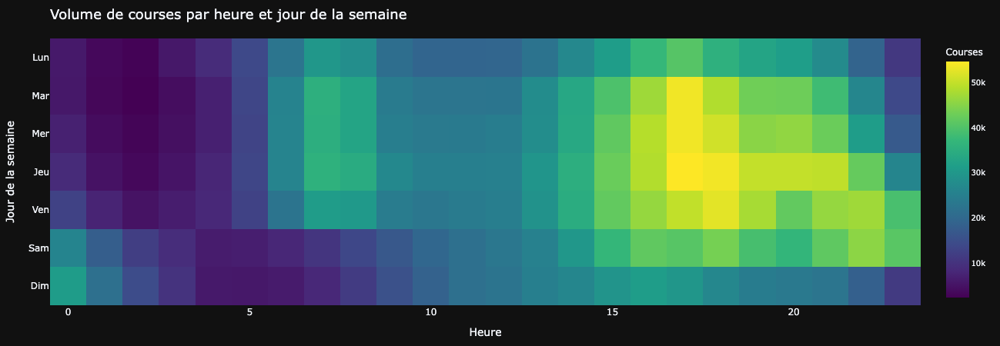
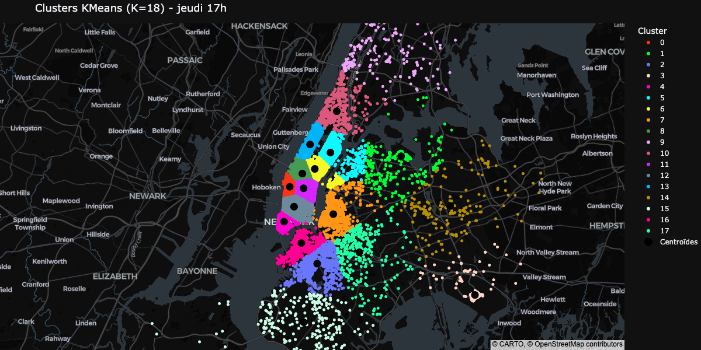
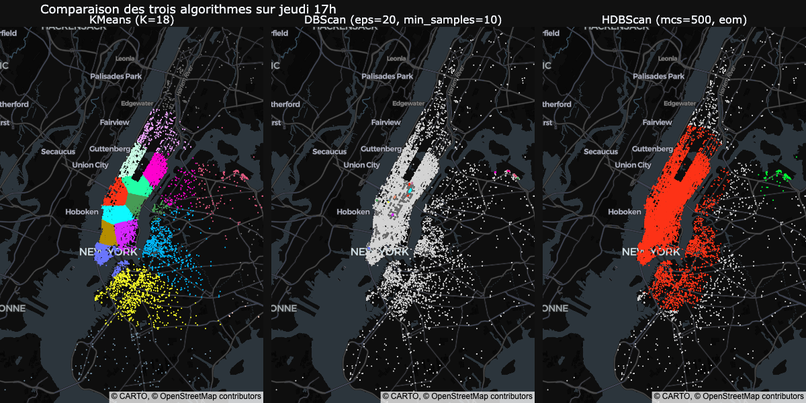
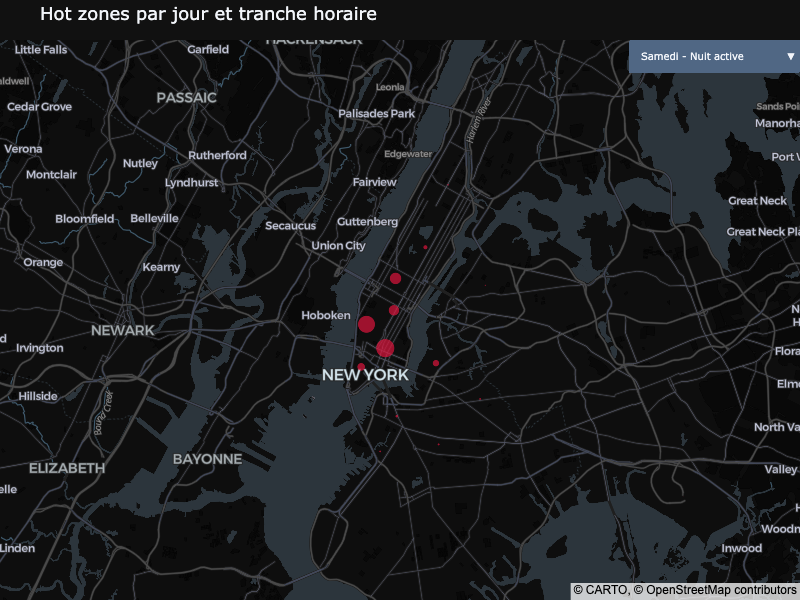

# Uber Pickups : identifier les hot zones de demande à New York

<br><br>

<br><br>

> Projet de machine learning non supervisé · Certification CDSD, bloc 3 · Auteur : **Yoann ROBERT**

> **TL;DR** : Visualiser le [notebook complet](https://yoannrobert.github.io/jedha_projects/bloc3/Uber_Pickups/html/Uber_Pickups.html) en ligne 
ou les dashboards associés permettant de visualiser les hot zones 
[par régime hebdomadaire et par tranche horaire](https://yoannrobert.github.io/jedha_projects/bloc3/Uber_Pickups/html/23_tableau_de_bord_hot_zones_regime_hebdo_et_tranche_horaire.html) 
ou [par jour et par tranche horaire](https://yoannrobert.github.io/jedha_projects/bloc3/Uber_Pickups/html/24_tableau_de_bord_hot_zones_jour_et_tranche_horaire.html).

Identification des zones d'attente optimales (hot zones) pour les chauffeurs Uber à New York, par clustering géo-temporel de 4,33 millions de pickups, avec comparaison méthodologique de trois algorithmes (KMeans, DBScan, HDBScan) et production de tableaux de bord interactifs à granularité variable.

## Contexte et problématique

[Uber](https://www.uber.com) est une plateforme de mise en relation entre chauffeurs et passagers, présente dans plus de 70 pays. Sur des marchés denses comme New York, une difficulté opérationnelle récurrente est l'asymétrie spatiale entre offre et demande : un utilisateur peut être dans un quartier où aucun chauffeur n'est disponible, tandis que des chauffeurs cherchent des passagers ailleurs. Cette friction se traduit par des temps d'attente prolongés et des annulations.

**L'objectif du projet est d'identifier les zones d'attente optimales à proposer aux chauffeurs, à différentes granularités temporelles**, à partir de l'historique des pickups Uber à New York. Le projet comporte aussi une dimension méthodologique : comparer plusieurs algorithmes de clustering non supervisé pour déterminer celui qui est le mieux adapté aux particularités du jeu de données, notamment sa concentration géographique extrême.

## Données

|                 |                                                                                                                                                                            |
|-----------------|----------------------------------------------------------------------------------------------------------------------------------------------------------------------------|
| **Source**      | Archive ZIP fournie par Jedha · [dataset](https://full-stack-bigdata-datasets.s3.eu-west-3.amazonaws.com/Machine+Learning+non+Supervis%C3%A9/Projects/uber-trip-data.zip)  |
| **Volume**      | 4,33 millions de pickups après nettoyage et filtrage géographique                                                                                                          |
| **Granularité** | Une ligne = un pickup, horodaté à la minute et géolocalisé en GPS                                                                                                          |
| **Périmètre**   | Six mois de l'année 2014 (avril à septembre) sur les cinq arrondissements de New York (Manhattan, Brooklyn, Queens, Bronx, Staten Island)                                  |
| **Variables**   | Date et heure du pickup, latitude, longitude, base Uber affiliée                                                                                                           |

Les données 2015 fournies dans l'archive sont écartées : elles ne contiennent pas de coordonnées GPS exploitables, mais uniquement un identifiant de zone administrative, incompatible avec un clustering géographique fin.

## Démarche

L'étude est conduite dans un notebook unique, en neuf temps :

1. **Préparation des données** : concaténation des CSV mensuels de 2014, conversion des types, feature engineering temporel (mois, jour de semaine, heure), filtrage strict aux frontières de NYC par jointure spatiale sur le GeoJSON officiel des cinq arrondissements (limites étendues incluant ponts, quais et terminaux de ferries).
2. **Analyse exploratoire** : distributions temporelles (heatmap jour × heure), distributions spatiales (concentration sur Manhattan, contraste de densité entre quartiers), croisements spatio-temporels (variation des hot zones selon la phase d'activité).
3. **Échantillonnage représentatif** : tirage uniforme de 200 000 points préservant les densités relatives, destiné à rendre DBScan tractable.
4. **Clustering avec KMeans** : projection métrique en EPSG:32618 (UTM Zone 18N), recherche du nombre optimal de clusters par double balayage (méthode du coude et score de silhouette), application à 12 sous-ensembles croisant régime hebdomadaire et tranche horaire.
5. **Clustering avec DBScan** : recherche exhaustive d'hyperparamètres sur 135 combinaisons (`eps` de 20 à 300 m, `min_samples` de 4 à 200), évaluation par six indicateurs.
6. **Clustering avec HDBScan** : recherche systématique sur 12 combinaisons (taille minimale de cluster × méthode de sélection).
7. **Comparaison des trois algorithmes** : critères, tableau récapitulatif et visualisation côte à côte sur un sous-ensemble commun.
8. **Visualisation des hot zones** : production de deux tableaux de bord interactifs Plotly à dropdowns, l'un par couple (régime hebdomadaire, tranche horaire), l'autre par couple (jour, tranche horaire).
9. **Conclusion et recommandations à Uber** : algorithme à retenir, granularité opérationnelle, hot zones prioritaires, limites et perspectives.

La démarche suit la méthodologie "start small grow big" préconisée par Jedha : commencer par un cas particulier (jeudi 17h, la case la plus chargée), valider le pipeline, puis généraliser.

## Principaux résultats

**Le constat central : un jeu de données à concentration géographique extrême, défavorable aux algorithmes de densité.** Manhattan absorbe 78% des pickups, et 1% des cellules d'une grille kilométrique en concentrent 32%. Les densités locales varient d'un facteur ~74 000 entre la cellule la plus dense et celle du 90e centile. Cette structure rend les algorithmes basés sur la densité (DBScan, HDBScan) inopérants, alors que KMeans, qui partitionne par géométrie, produit des hot zones cohérentes et exploitables.



L'exploration temporelle révèle trois phases d'activité bien distinctes : un pic matinal en semaine (7h-9h), un grand pic du soir en semaine (17h-21h), et un pic nocturne propre au week-end (0h-2h) qui inverse complètement le sens de cette tranche horaire entre les deux régimes hebdomadaires.

En réponse aux objectifs du projet :

- **KMeans est le seul algorithme à produire un clustering opérationnellement exploitable.** Avec K=18 sur jeudi 17h (case la plus chargée), il identifie 18 hot zones correspondant à des points d'intérêt reconnaissables : Midtown, East Village, Murray Hill, Flatiron, Financial District, Upper East/West Side, Chelsea, Williamsburg, ainsi que l'aéroport LaGuardia. Aucun point n'est rejeté en bruit, et la taille des clusters varie sur un facteur 9, ce qui reflète bien la hiérarchie de la demande.



- **DBScan échoue par incapacité à fragmenter Manhattan.** Sur 135 combinaisons d'hyperparamètres testées, le comportement est bimodal : pour `eps` ≥ 40 m, un super-cluster manhattanais absorbe 50 à 80% des points (la chaîne de voisinage propage la connectivité à travers tout l'arrondissement) ; pour `eps` ≤ 20 m, l'algorithme produit jusqu'à 1 753 micro-clusters indistinguables et 30% de bruit. Aucune zone intermédiaire ne fournit un clustering exploitable.

- **HDBScan échoue par le même mécanisme, sous une forme différente.** Manhattan apparaît comme un cluster stable à toutes les échelles de densité. En mode `"eom"` (par défaut), HDBScan le sélectionne tel quel et le super-cluster absorbe 84 à 92% des points. En mode `"leaf"`, l'algorithme descend dans la hiérarchie au prix d'un taux de bruit oscillant entre 65 et 81%. Aucune des 12 combinaisons testées ne satisfait simultanément les critères opérationnels.



- **La géographie des hot zones varie significativement entre la semaine et le week-end.** Manhattan cède 10 points à Brooklyn le week-end (passant de 81% à 71% des pickups), au profit principalement de Williamsburg. La distinction par régime hebdomadaire est donc nécessaire, mais la variation reste modérée d'une heure à l'autre au sein d'un même type de jour.

- **Un tableau de bord interactif restitue les 42 clusterings par couple (jour, tranche horaire)**, accessible par un dropdown unique. Il complète une vue plus agrégée par régime × tranche horaire (12 clusterings) qui distingue les profils de demande matin, midi, après-midi, soir, nuit profonde et nuit active.



## Recommandations pour Uber

- **Intégrer KMeans avec K=18 en production.** Seul algorithme des trois testés à produire des hot zones exploitables, et suffisamment rapide (moins de 5 secondes par clustering, moins d'une minute pour les 42 clusterings jour × tranche horaire) pour être recalculé périodiquement de manière automatisée.
- **Adopter la granularité jour × tranche horaire comme vue de référence.** Elle distingue les profils spécifiques de chaque jour (vendredi soir différent de lundi soir), reste exploitable par un chauffeur consultant une carte ciblée sur sa tranche courante, et évite la sur-granularité à l'heure près pour laquelle les variations restent faibles.
- **Intégrer en priorité les huit hot zones structurelles** identifiées comme récurrentes à travers les clusterings, par ordre de poids :

| Rang | Zone                                            | Caractérisation                                       |
|------|-------------------------------------------------|-------------------------------------------------------|
| 1    | **Chelsea / West Village**                      | Pôle d'activité majeur                                |
| 2    | **East Village / NoHo / Greenwich Village**     | Quartiers de vie nocturne et résidentielle            |
| 3    | **Midtown East / Grand Central**                | Centre des affaires, demande matin et soir en semaine |
| 4    | **Midtown West / Times Square / Penn Station**  | Hub touristique et transport, demande continue        |
| 5    | **Flatiron / Union Square / Gramercy**          | Mixte bureaux/résidentiel, activité étalée            |
| 6    | **Financial District / Tribeca / Battery Park** | Centre financier, demande matin et soir               |
| 7    | **Williamsburg (Brooklyn)**                     | Plus structurel des arrondissements hors Manhattan    |
| 8    | **Upper West Side / Lincoln Center**            | Activité résidentielle et culturelle                  |

- **Traiter à part les deux pôles aéroportuaires**, géographiquement isolés et à dynamique très différente du centre. Ils méritent un dispositif dédié dans l'application (notification de demande prévisible aux heures de vol).

| Zone                  | Caractérisation                           |
|-----------------------|-------------------------------------------|
| **JFK Airport**       | Forte demande en fin d'après-midi et soir |
| **LaGuardia Airport** | Demande aux heures de pointe et de vol    |

## Structure du projet

```
.
├── data                              # créé automatiquement à la première exécution
├── images                            # visualisations exportées (PNG)
├── notebooks/Uber_Pickups.ipynb      # notebook complet
├── README.md                         # ce fichier
├── Uber_Pickups_Guidelines.md        # consignes données par Jedha
└── requirements.txt                  # dépendances Python
```

## Installation et exécution

Prérequis :
- Python 3.13+

```bash
pip install -r requirements.txt
```

Ouvrir ensuite le notebook et exécuter les cellules dans l'ordre. Au premier lancement, le notebook télécharge automatiquement l'archive des pickups Uber et le GeoJSON des arrondissements de New York depuis [NYC Open Data](https://opendata.cityofnewyork.us/) dans le dossier `data/` (créé à l'occasion), puis décompresse les CSV. Les exécutions suivantes réutilisent les fichiers locaux sans nouveau téléchargement.

Aucune configuration n'est requise. Le projet est entièrement autonome.

## Limites

Résultats à lire avec prudence méthodologique :

1. **Période couverte limitée à six mois de 2014.** Les données 2015, dépourvues de coordonnées GPS, ont dû être écartées. Une analyse sur une année complète permettrait de capturer les variations saisonnières (été touristique, hiver, fêtes).
2. **Variables exogènes non prises en compte.** La météo, les événements spéciaux (concerts, matchs, manifestations), les jours fériés et les perturbations de transport public sont susceptibles de modifier significativement la géographie des pickups. Leur intégration nécessiterait un enrichissement par jointure avec des sources externes.
3. **K fixé à 18 sur toutes les tranches.** Choix retenu pour la cohérence comparative entre clusterings, mais le nombre optimal de hot zones varie probablement selon l'intensité d'activité de chaque tranche. Un balayage spécifique par tranche serait possible au prix d'une complexification de l'interprétation.
4. **Granularité fine non restituée.** La granularité par heure (168 partitions) n'a pas été retenue, faute de combinatoire entre dropdowns en Plotly natif. Une application Streamlit lèverait cette limite et offrirait un tableau de bord pleinement combinatoire.
5. **Approches alternatives non explorées.** KMedoids (centroïdes garantis sur des positions réelles), GMM (clusters elliptiques) et BIRCH (scalable sans échantillonnage) pourraient enrichir la comparaison méthodologique.
6. **Mesure de qualité non systématique sur les 42 partitions.** La silhouette n'a été utilisée que pour calibrer K sur le start small. Les 42 partitions à K=18 figé sont jugées par cohérence métier et comparaison visuelle. Une étude de stabilité au seed et un suivi quantitatif par silhouette/inertie sur l'ensemble des partitions constitueraient une perspective d'industrialisation.

## Stack technique

Python · pandas · scikit-learn · Plotly · GeoPandas · Shapely