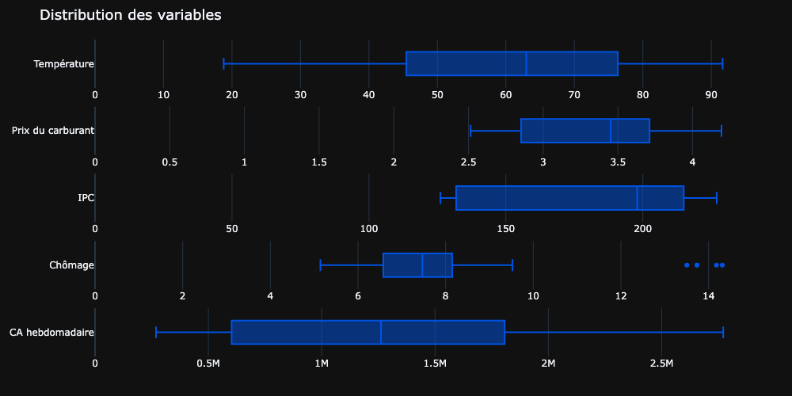
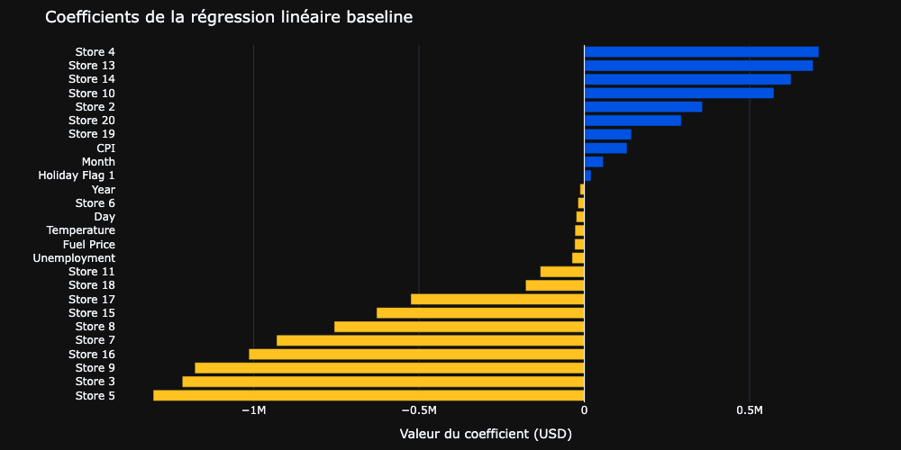
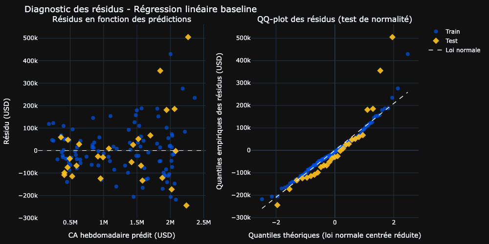
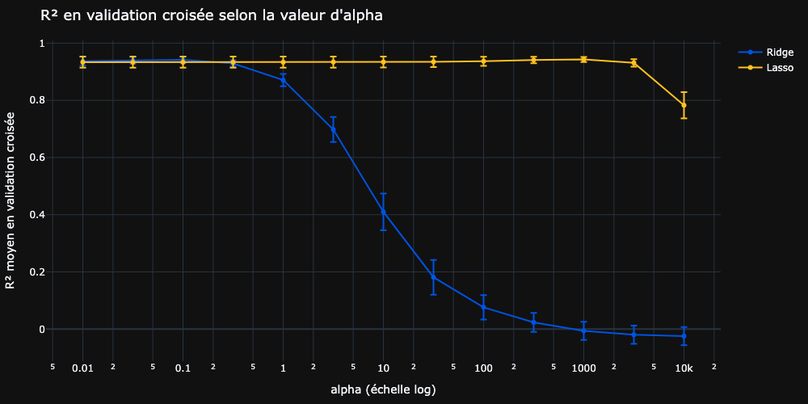
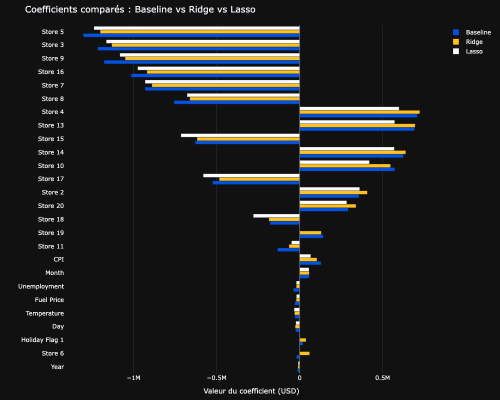

# Walmart Sales : prédire le chiffre d'affaires hebdomadaire des magasins

<br><br>

<br><br>

> Projet de machine learning supervisé · Certification CDSD, bloc 3 · Auteur : **Yoann ROBERT**

Construction d'un modèle de régression linéaire qui estime les ventes hebdomadaires de 20 magasins Walmart à partir 
d'indicateurs économiques et calendaires, avec comparaison d'une baseline non régularisée et de deux variantes 
régularisées (Ridge, Lasso) optimisées par `GridSearchCV`, et interprétation des coefficients pour identifier les 
leviers utilisables par le service marketing.

## Contexte et problématique

[Walmart](https://www.walmart.com) est une multinationale américaine de la grande distribution. 
Son service marketing souhaite mieux comprendre comment les indicateurs économiques (chômage, indice des prix à la 
consommation, prix du carburant) et calendaires (jours fériés, saisonnalité) influencent le chiffre d'affaires 
hebdomadaire de ses magasins. **L'objectif du projet est de construire un modèle de régression supervisé qui estime 
ces ventes avec la meilleure précision possible**, et d'analyser ses coefficients pour dégager les leviers utilisables 
en planification de campagnes.

Le projet impose une démarche méthodologique en trois temps : EDA et préparation des données, baseline linéaire non 
régularisée, puis régularisation par Ridge et Lasso avec optimisation des hyperparamètres par validation croisée.

## Données

|                            |                                                                                                                                                                                                                                                                                                                |
|----------------------------|----------------------------------------------------------------------------------------------------------------------------------------------------------------------------------------------------------------------------------------------------------------------------------------------------------------|
| **Source**                 | [Fichier CSV](https://julie-resources.s3.eu-west-3.amazonaws.com/full-stack-full-time/projects-supervised-machine-learning-ft/walmart-sales-ft/Walmart_Store_sales.csv) fourni par Jedha, retravaillé à partir d'une [compétition Kaggle](https://www.kaggle.com/c/walmart-recruiting-store-sales-forecasting) |
| **Volume**                 | 150 lignes × 8 colonnes en entrée, 131 lignes après nettoyage                                                                                                                                                                                                                                                  |
| **Granularité**            | Une ligne = un magasin × une semaine                                                                                                                                                                                                                                                                           |
| **Couverture**             | 20 magasins, période 2010 à 2012 (échantillon partiel)                                                                                                                                                                                                                                                         |
| **Variables explicatives** | `Store`, `Date`, `Holiday_Flag`, `Temperature`, `Fuel_Price`, `CPI`, `Unemployment`                                                                                                                                                                                                                            |
| **Cible**                  | `Weekly_Sales` (chiffre d'affaires hebdomadaire en USD)                                                                                                                                                                                                                                                        |

Le jeu contient entre 8 et 12% de valeurs manquantes selon les colonnes (y compris la cible) et quelques valeurs 
aberrantes sur `Unemployment`, à traiter en amont du modèle.

## Démarche

L'étude est conduite dans un notebook unique, en trois parties suivies d'une annexe :

1. **EDA et préparation des données** :
analyse univariée et corrélations, traitement des valeurs manquantes (suppression des lignes sans cible, imputation 
par médiane pour les variables numériques, par mode pour les catégorielles), retrait des outliers hors 
$[\bar{X} \pm 3\sigma]$, décomposition de `Date` en `Year`, `Month`, `Day` et `Week_of_year` (encodée en `sin/cos` 
pour préserver sa cyclicité), split train/test stratifié sur `Store` et assemblage d'un `ColumnTransformer` 
scikit-learn (standardisation des numériques, one-hot encoding des catégorielles).
2. **Régression linéaire baseline** :
ajustement d'une `LinearRegression` non régularisée sur le pipeline précédent, évaluation par R², RMSE et MAE sur 
train et test, diagnostic graphique des résidus (linéarité, homoscédasticité, normalité) et interprétation des 
coefficients standardisés.
3. **Régularisation Ridge et Lasso** :
optimisation de l'hyperparamètre `alpha` par `GridSearchCV` à 5 plis sur 13 valeurs réparties logarithmiquement entre 
`1e-2` et `1e4`, comparaison équitable des trois modèles en validation croisée, et lecture des coefficients régularisés.
4. **Annexe** :
test d'une transformation logarithmique de la cible pour traiter l'hétéroscédasticité observée en Partie 2 (hors 
périmètre Jedha mais présenté en complément méthodologique).

## Principaux résultats

**Le constat central : sur ce jeu de données très restreint (131 observations pour 26 variables après one-hot encoding), 
l'identité du magasin domine très largement le signal, et la régularisation apporte un gain modéré en performance 
moyenne, mais réel en stabilité.** 
Les autres variables ont des effets d'un ordre de grandeur inférieur, et la plupart des variables temporelles sont 
négligeables.



En réponse aux objectifs du projet :

- **Quelle qualité de prédiction pour la baseline ?** 
La régression linéaire atteint un R² de 0,9524 sur le test et une MAE d'environ 111k USD, soit ~7% de la moyenne des 
ventes hebdomadaires. La RMSE test est 49% supérieure à celle du train, signature d'un sur-apprentissage cohérent avec 
le ratio d'environ 4 observations par variable.

- **Quelles variables portent l'information ?** Les coefficients des dummies magasin atteignent ±1,3M USD, soit un 
ordre de grandeur au-dessus du reste. L'IPC est le seul indicateur économique au signal franc (+104k USD par écart-type, 
soit ~8% du CA moyen). Le chômage, le prix du carburant, la température et les variables temporelles n'apportent 
quasiment rien. Le drapeau jour férié est lui aussi négligeable.



- **Les hypothèses de la régression linéaire tiennent-elles ?** Partiellement. Le diagnostic des résidus révèle une 
**hétéroscédasticité nette** (dispersion qui croît avec la valeur prédite), tandis que la normalité est globalement 
acceptable et la linéarité validée par l'absence de structure systématique. La transformation logarithmique testée en 
annexe améliore la MAE de 6,8% mais ne corrige pas réellement la structure du résidu.



- **La régularisation améliore-t-elle le modèle ?** Oui, mais modestement. Ridge et Lasso atteignent des performances 
quasi identiques en validation croisée (écart de R² CV moyen de 0,0014, inférieur à l'écart-type entre plis). 
Lasso n'annule qu'une seule variable sur 26 (`Store 19`) : la sélection automatique attendue ne se concrétise pas sur 
ce jeu de données.



- **Quel modèle final retenir ?** **Ridge avec α = 0,1**, sur la base d'une comparaison équitable des trois modèles en 
validation croisée à 5 plis :

| Métrique CV          | Baseline | Ridge  | Lasso  | Gain Ridge vs Baseline   |
|----------------------|----------|--------|--------|--------------------------|
| R² CV moyen          | 0,9335   | 0,9414 | 0,9428 | +0,0079                  |
| R² CV écart-type     | 0,0195   | 0,0109 | 0,0086 | divisé par 1,8           |
| R² CV pire pli       | 0,9023   | 0,9247 | 0,9329 | +0,0224                  |

Le gain moyen reste modeste, mais **l'effet stabilisateur attendu d'une régularisation est franc** : la variance entre 
plis est presque divisée par deux, et le pire pli progresse de 0,022 de R². Ridge est préféré à Lasso pour sa stabilité 
numérique, les performances étant indissociables sur ce jeu. 
Ridge atténue les coefficients magasin les plus grands en valeur absolue sans en annuler aucun : les extrêmes vont de 
-1,20M USD à +0,72M USD selon le magasin. Lasso, lui, n'annule qu'une seule variable (`Store 19`) et n'en écrase 
fortement que deux autres sans pour autant les annuler : `Store 6` passe de -19 308 USD en baseline à 763 USD, et 
`Holiday_Flag` 1 de 20 330 USD à 2 658 USD. Ces trois variables figurent parmi celles déjà identifiées comme 
négligeables en Partie 2, ce qui valide a posteriori l'analyse des coefficients de la baseline.



## Recommandations pour le service marketing

- **Personnaliser les actions par magasin.** Les coefficients Ridge vont de -1,20M USD à +0,72M USD selon le magasin, 
un écart sans commune mesure avec les autres effets. Un budget marketing différencié par point de vente sera plus 
efficace qu'une campagne nationale uniforme.
- **Suivre l'IPC comme principal signal macro-économique.** C'est le seul indicateur économique au signal franc dans 
le modèle Ridge : un écart-type supplémentaire d'IPC est associé à environ +104k USD de ventes hebdomadaires, soit ~8% 
du CA moyen. Les autres indicateurs (chômage, carburant, température) ont des effets d'un ordre de grandeur inférieur.
- **Ne pas miser sur les jours fériés sans données complémentaires.** Le drapeau jour férié reste un coefficient faible 
(~2,7k USD dans Lasso, négligeable dans Ridge), cohérent avec l'analyse de la Partie 2. Avec 131 observations, le 
signal peut tout simplement être trop faible pour être détecté : une collecte ciblée autour des grandes périodes 
commerciales s'impose avant tout engagement budgétaire.
- **Communiquer les prévisions avec une fourchette.** Le pire pli en validation croisée tombe à R² = 0,9247, signe 
d'une dispersion non négligeable. Toute prédiction devrait être assortie d'une marge de l'ordre de ±120k USD (ordre de 
grandeur de la MAE test), pour éviter une lecture faussement précise.
- **Étendre le jeu de données pour franchir un palier.** La MAE de ~7% reste perfectible. 
Trois pistes complémentaires : élargir l'échantillon à plusieurs milliers d'observations, retester une transformation 
logarithmique de la cible avec plus de données, et essayer des modèles non linéaires (forêts aléatoires, gradient 
boosting) qui captent les interactions sans hypothèse explicite.

## Structure du projet

```
.
├── README.md                       # ce fichier
├── requirements.txt                # dépendances Python
├── Walmart_sales_Guidelines.md     # consignes données par Jedha
├── images                          # visualisations exportées (PNG)
└── notebooks/Walmart_sales.ipynb   # notebook complet
```

## Installation et exécution

Prérequis :
- Python 3.13+

```bash
pip install -r requirements.txt
```

Le jeu de données est lu directement depuis son URL publique sur AWS S3, aucun téléchargement manuel n'est nécessaire. 
Il suffit d'ouvrir le notebook et d'exécuter les cellules dans l'ordre.

Deux drapeaux en tête de notebook contrôlent les sorties : `SHOW_INTERACTIVE_FIG` affiche les figures Plotly en mode 
interactif, et `EXPORT_IMG` régénère les exports PNG. L'export statique des figures Plotly repose sur `kaleido`. 
Sur certaines installations récentes, une étape supplémentaire est nécessaire pour installer une version embarquée de 
Chrome/Chromium :

```bash
kaleido_get_chrome      # ou, de façon équivalente : plotly_get_chrome
```

Sans cette étape, tout appel à `fig.write_image(...)` échoue avec une erreur du type 
`Kaleido requires Google Chrome to be installed`. Le notebook fonctionne en mode purement interactif sans cette étape, 
qui n'est requise que pour régénérer les PNG.

## Limites

Résultats à lire avec prudence méthodologique :

1. **Échantillon très réduit.** 131 observations pour 26 variables après one-hot encoding, couverture limitée à 20 
magasins sur 2010 à 2012. Toute généralisation hors de ce périmètre est risquée. La petite taille du test set 
(26 observations) explique aussi pourquoi le R² test sur Baseline (0,9524) dépasse celui de Ridge (0,9494) alors que 
Ridge gagne nettement en validation croisée : la CV intègre 5 mesures et fournit une estimation plus robuste.
2. **Hétéroscédasticité des résidus non corrigée.** Le diagnostic en 2.4 a montré une dispersion qui croît avec la 
valeur prédite. La transformation logarithmique testée en annexe améliore la MAE de 6,8% mais dégrade légèrement la 
RMSE (+2,6%) et ne supprime pas la forme en entonnoir du graphique. La piste reste valable pour une v2 avec plus de 
données.
3. **Hypothèse de linéarité.** Le modèle ne capture ni interactions ni effets non linéaires. Les coefficients magasin 
captent indirectement une grande part de variabilité fixe (taille du point de vente, zone de chalandise, mix produit) 
qu'un modèle explicitement structuré pourrait expliciter.
4. **Sélection de variables par Lasso peu informative.** Sur ce jeu, Lasso n'annule qu'une seule variable sur 26 et 
n'apporte donc pas la valeur ajoutée attendue. La parcimonie espérée ne se matérialise pas, probablement par manque 
d'observations pour discriminer les contributions individuelles.
5. **Corrélation n'est pas causalité.** Les coefficients ne mesurent que des associations statistiques conditionnelles, 
pas des effets causaux. Les recommandations sont des hypothèses de travail, à valider par expérimentation en magasin.

## Stack technique

Python · pandas · NumPy · scikit-learn · Plotly