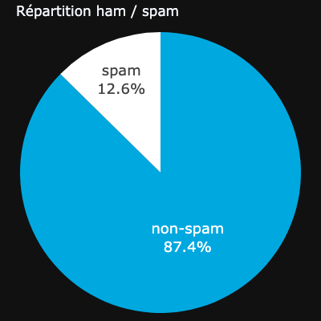
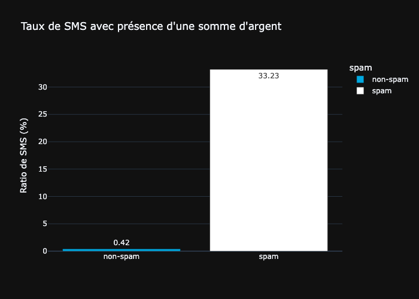
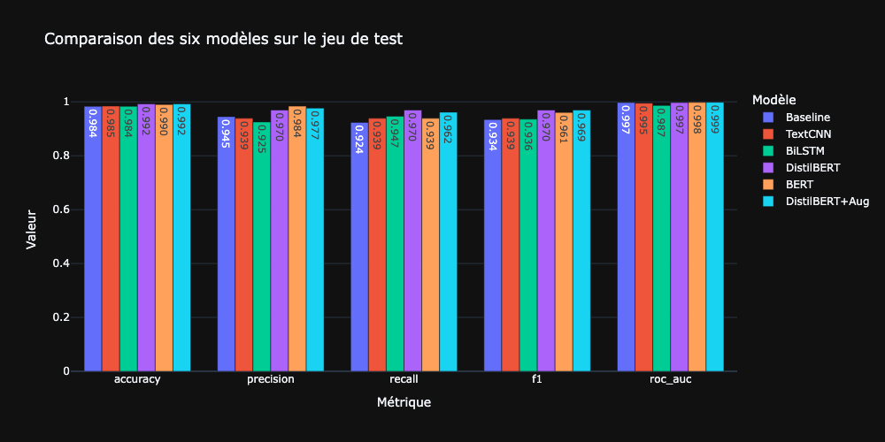
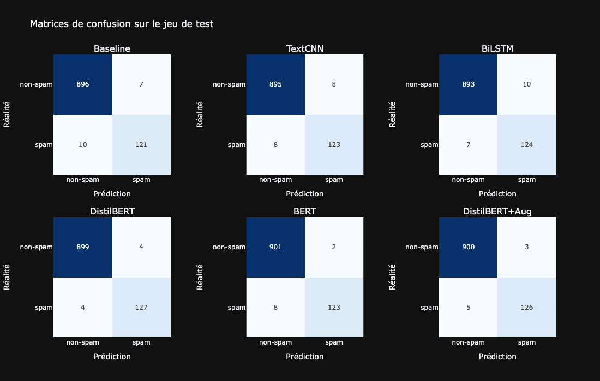
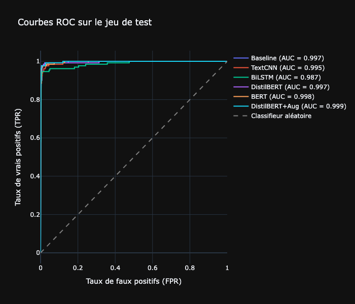

# AT&T Spam Detector : détecter automatiquement les SMS frauduleux par deep learning

<br><br>

<br><br>

> Projet de deep learning · Certification CDSD, bloc 4 · Auteur : **Yoann ROBERT**

Construction d'un classifieur de SMS spam/ham par deep learning sur un jeu déséquilibré de 5572 messages, 
avec comparaison de six modèles couvrant deux familles d'architectures (trois réseaux construits de zéro, 
trois transformers pré-entraînés fine-tunés), expérimentation d'une augmentation de données ciblée sur la 
classe minoritaire, et analyse qualitative des erreurs résiduelles du modèle retenu.

## Contexte et problématique

[AT&T](https://www.att.com) est une entreprise américaine de télécommunications, première mondiale du 
secteur par chiffre d'affaires en 2022 et troisième opérateur de téléphonie mobile aux États-Unis. 
L'un des points de friction récurrents pour ses abonnés est l'exposition constante aux SMS spam. 
Le signalement manuel actuellement en place ne passe pas à l'échelle. 
**L'objectif du projet est de construire un modèle de deep learning capable de classer automatiquement 
un SMS comme spam ou non-spam à partir du seul contenu textuel du message**, avec une performance 
mesurée sur un jeu de test isolé en début de projet et jamais utilisé pendant l'entraînement.

Deux orientations méthodologiques structurent la démarche : commencer par une architecture simple avant 
d'explorer des modèles plus sophistiqués, et tirer parti du transfer learning pour contourner la taille 
modeste du jeu de données.

## Données

|                 |                                                                                                                                                             |
|-----------------|-------------------------------------------------------------------------------------------------------------------------------------------------------------|
| **Source**      | Fichier CSV hébergé sur AWS S3, fourni par Jedha · [dataset](https://full-stack-bigdata-datasets.s3.eu-west-3.amazonaws.com/Deep+Learning/project/spam.csv) |
| **Volume**      | 5572 SMS étiquetés (5169 après suppression des doublons)                                                                                                    |
| **Granularité** | Une ligne = un SMS, identifié par son contenu textuel                                                                                                       |
| **Variables**   | `v1` (étiquette `ham` ou `spam`), `v2` (contenu du SMS), plus trois colonnes auxiliaires majoritairement vides                                              |
| **Cible**       | Classe binaire `spam` (positive dans 12,6% des cas), soit un déséquilibre de classes marqué (~7:1)                                                          |



## Démarche

L'étude est conduite dans un notebook unique, en sept parties :

1. **Chargement et préparation des données** : 
lecture du CSV, suppression des doublons, traitement des valeurs manquantes et concaténation des 
colonnes auxiliaires dans le contenu principal, encodage binaire de la cible.
2. **Analyse exploratoire (EDA)** : 
caractérisation du déséquilibre de classe et identification de marqueurs textuels discriminants 
(longueur du message, présence de sommes d'argent, d'URL, de mots à charge commerciale, ratio de 
majuscules, notion d'urgence, ponctuation excessive).
3. **Préparation des données pour le deep learning** : 
séparation train/validation/test stratifiée sur la cible (60/20/20), tokenisation des SMS 
(`tiktoken` pour les modèles construits de zéro, tokenizers Hugging Face pour les transformers), 
construction des `Dataset` et `DataLoader` PyTorch, mise en place d'une repondération de classe 
via une `CrossEntropyLoss` pondérée pour compenser le déséquilibre sur les modèles construits de zéro.
4. **Modèles construits de zéro** : 
entraînement de trois architectures de complexité croissante représentatives de trois familles de 
réseaux, à boucle d'entraînement et données identiques pour une comparaison équitable.
    - Modèle 1 : baseline *feed-forward* à embedding moyenné, qui ignore l'ordre des mots.
    - Modèle 2 : TextCNN, réseau convolutif 1D capturant les n-grammes locaux.
    - Modèle 3 : BiLSTM, réseau récurrent bidirectionnel modélisant les dépendances séquentielles.
5. **Transfer learning avec DistilBERT** : 
fine-tuning de `distilbert-base-uncased` via l'API `Trainer` de Hugging Face, puis comparaison avec 
le modèle complet `bert-base-uncased` pour mesurer l'apport de la capacité supplémentaire.
6. **Augmentation de données ciblée** : 
variante allégée de la méthode EDA (Wei & Zou, 2019) appliquée uniquement aux spams pour 
rééquilibrer mécaniquement la distribution, avec protection des tokens identifiés comme 
discriminants en partie 2 (mots à charge commerciale, symboles monétaires, URL, nombres, 
majuscules), puis fine-tuning d'un DistilBERT augmenté.
7. **Évaluation finale sur le jeu de test** : 
mesure des six modèles sur le jeu de test isolé, comparaison des métriques, des courbes ROC et 
des matrices de confusion, sélection du modèle retenu et analyse qualitative de ses erreurs 
résiduelles.

Une analyse de variance entre runs identiques est conduite à la fois sur le BiLSTM (partie 4.4.1) et 
sur DistilBERT (partie 5.7) pour distinguer les écarts attribuables aux modèles eux-mêmes de ceux 
relevant de la variabilité d'exécution sur backend MPS.

## Principaux résultats

**Le constat central : un palier de performance fonction de la famille de modèles, pas de leur capacité 
individuelle.** Les six modèles se répartissent en deux groupes nets, séparés d'environ 3 points de F1 
test. À l'intérieur de chaque groupe, les écarts restent dans la plage de variance d'exécution. 
Le facteur déterminant est l'usage ou non d'un modèle pré-entraîné sur un large corpus de texte 
généraliste.

L'EDA a mis en évidence cinq marqueurs lexicaux et structurels fortement discriminants. Le plus net est 
la présence d'une somme d'argent (symbole `$`, `€` ou `£`), observée dans 33% des spams contre 
seulement 0,4% des messages légitimes. Cette régularité lexicale prépare le terrain pour des modèles 
exploitant la sémantique du texte sans nécessiter de feature engineering manuel.



En réponse aux objectifs du projet :

- **Quelle performance pour les modèles construits de zéro ?** 
Les trois architectures (baseline, TextCNN, BiLSTM) convergent autour d'un F1 test commun de ~0,935, 
malgré des biais inductifs radicalement différents (sac de mots, n-grammes locaux, dépendances 
séquentielles). L'analyse de variance du BiLSTM sur 100 runs confirme que les petits écarts observés 
entre ces trois modèles sont dans la plage de variance d'exécution. Le signal discriminant est 
essentiellement **lexical** sur cette tâche, ce qui prive les architectures plus expressives de leur 
avantage théorique.

- **Le transfer learning apporte-t-il un gain net ?** 
Oui, et le gain est franc. Les trois transformers fine-tunés (DistilBERT, BERT, DistilBERT augmenté) 
convergent autour d'un F1 test de ~0,965, soit ~3 points au-dessus du palier précédent. À l'intérieur 
de cette famille, les écarts sont marginaux : doubler les paramètres en passant à BERT ne déplace pas 
significativement l'aiguille, et l'augmentation de données n'apporte qu'un gain négligeable. Une 
analyse de variance sur 10 runs de DistilBERT montre une reproductibilité bit-à-bit, ce qui confirme 
que les écarts entre transformers reflètent des différences réelles entre modèles et non du bruit.



- **L'augmentation de données ciblée tient-elle ses promesses ?** 
Partiellement. La stratégie protège bien les tokens discriminants identifiés à l'EDA et produit des 
spams synthétiques plausibles à l'inspection qualitative. Sur le test, le DistilBERT augmenté atteint 
un F1 de 0,9692 contre 0,9695 pour le DistilBERT de référence, soit un écart non significatif. 
L'augmentation ne dégrade aucune métrique mais ne suffit pas à dépasser le plafond observé.

- **Quel modèle retenir ?** **DistilBERT (sans augmentation), au regard du compromis coût/performance.** 
Sur le jeu de test, il atteint un profil parfaitement symétrique (precision = recall = F1 = 0,9695) 
avec 4 faux positifs et 4 faux négatifs sur 1034 SMS. Trois arguments convergent en sa faveur :
meilleur F1 test parmi les six modèles, coût d'inférence et d'entraînement environ deux fois moindre 
que BERT, et effet de l'augmentation jugé marginal au regard de la complexité supplémentaire.



- **Le plafond observé est-il un plafond du modèle ou des données ?** 
L'analyse qualitative des 8 erreurs résiduelles de DistilBERT plaide pour les données. Deux des 
quatre faux négatifs (un quiz Simpsons, une blague de bureau de police) ressemblent à des messages 
d'humour personnels et semblent **mal étiquetés dans le dataset original**. Les quatre faux positifs 
sont des cas légitimement ambigus, qui partagent des marqueurs typiques de spam (vocabulaire 
commercial, formulation de sondage automatisé, SMS impersonnel et technique). Le modèle applique 
correctement les régularités apprises sur ces cas frontières.

| Modèle                       | F1 test    | Recall (spam) | Precision (spam) | Paramètres |
|------------------------------|------------|---------------|------------------|------------|
| Baseline (embedding moyenné) | 0,9344     | 0,924         | 0,945            | ~6,4M      |
| TextCNN (convolutif 1D)      | 0,9389     | 0,939         | 0,939            | ~6,5M      |
| BiLSTM (récurrent)           | 0,9358     | 0,947         | 0,925            | ~6,5M      |
| **DistilBERT (fine-tuné)**   | **0,9695** | **0,970**     | **0,970**        | **67M**    |
| BERT (fine-tuné)             | 0,9609     | 0,939         | 0,984            | 109M       |
| DistilBERT + augmentation    | 0,9692     | 0,962         | 0,977            | 67M        |

Toutes les courbes ROC sont très proches du coin supérieur gauche (AUC entre 0,987 et 0,999), ce qui 
indique que le classement par probabilité décroissante de spam est de très bonne qualité pour 
l'ensemble des modèles. Les écarts de F1 observés tiennent davantage au comportement autour du seuil 
de décision à 0,5 qu'à la qualité du classement intrinsèque.



## Recommandations pour AT&T

- **Ajuster le seuil de décision plutôt que ré-entraîner.** 
L'analyse des courbes ROC montre que le seuil optimal au sens de Youden vaut 0,20, nettement inférieur 
au seuil par défaut de 0,5. Adopter un seuil plus bas augmente le recall sans coût de ré-entraînement. 
Le choix exact doit être calibré sur la validation en fonction des priorités métier : capturer 
davantage de spams au prix de quelques faux positifs supplémentaires, ou rester très conservateur 
côté expérience utilisateur.
- **Mettre en place un monitoring continu.** 
Les techniques des spammeurs évoluent. Un ré-entraînement périodique sur des données fraîches est 
nécessaire pour maintenir les performances dans le temps, accompagné d'un suivi des métriques de 
production.
- **Auditer la qualité des annotations.** 
L'analyse des erreurs a mis en évidence des cas vraisemblablement mal étiquetés dans le jeu original. 
Un audit qualité ciblé sur les SMS dont la prédiction du modèle s'écarte fortement de l'étiquette 
permettrait probablement d'améliorer mécaniquement les performances sans changer de modèle.
- **Privilégier DistilBERT pour la production.** 
Capacité équivalente à BERT pour environ moitié moins de paramètres, et performance légèrement 
supérieure sur cette tâche. Le compromis coût/performance est franchement en faveur du modèle 
distillé.

## Structure du projet

```
.
├── ATT_spam_detector_Guidelines.md    # consignes données par Jedha
├── README.md                          # ce fichier
├── requirements.txt                   # dépendances Python
├── images                             # visualisations exportées (PNG)
├── models                             # artefacts des modèles entraînés (dossier créé automatiquement à l'exécution)
└── notebooks/ATT_spam_detector.ipynb  # notebook complet
```

## Installation et exécution

Prérequis :
- Python 3.12+
- Accélérateur recommandé : GPU CUDA, ou MPS pour Apple Silicon. L'exécution sur CPU reste possible 
mais lente sur les transformers.

```bash
pip install -r requirements.txt
```

Le jeu de données est lu directement depuis son URL publique sur AWS S3, aucun téléchargement manuel 
n'est nécessaire. Il suffit d'ouvrir le notebook et d'exécuter les cellules dans l'ordre.

Deux drapeaux en tête de notebook contrôlent les sorties : `SHOW_INTERACTIVE_FIG` affiche les figures 
Plotly en mode interactif, et `EXPORT_IMG` régénère les exports PNG. L'export statique des figures 
Plotly repose sur `kaleido`. Sur certaines installations récentes, une étape supplémentaire est 
nécessaire pour installer une version embarquée de Chrome/Chromium :

```bash
kaleido_get_chrome      # ou, de façon équivalente : plotly_get_chrome
```

Sans cette étape, tout appel à `fig.write_image(...)` échoue avec une erreur du type 
`Kaleido requires Google Chrome to be installed`. Le notebook fonctionne en mode purement interactif 
sans cette étape, qui n'est requise que pour régénérer les PNG.

**Note sur la reproductibilité.** Une fonction `set_seed` est appelée avant chaque initialisation de 
modèle. Sur backend MPS, le fine-tuning de DistilBERT est strictement reproductible (variance nulle 
sur 10 runs), tandis que le BiLSTM présente une variance non négligeable inhérente aux opérations 
récurrentes non déterministes sur MPS (étudiée en partie 4.4.1).

## Limites

Résultats à lire avec prudence méthodologique :

1. **Plafond probable de qualité des annotations.** 
L'analyse qualitative des erreurs résiduelles de DistilBERT identifie des SMS vraisemblablement mal 
étiquetés dans le dataset original. Sur 8 erreurs au total, 2 paraissent relever d'un défaut 
d'annotation et 6 de cas authentiquement ambigus. Chercher à descendre sous ces 8 erreurs risquerait 
d'apprendre du bruit plutôt que du signal.
2. **Casse perdue par le tokenizer choisi.** 
Le checkpoint `distilbert-base-uncased` passe tout le texte en minuscules, détruisant un signal pourtant 
fort identifié à l'EDA (65,5% des spams contiennent plus de 10% de majuscules contre 10,6% des 
non-spams). Tester `distilbert-base-cased` permettrait probablement de récupérer ce signal.
3. **Augmentation simple sur les permutations et suppressions.** 
La méthode EDA retenue est conservatrice et préserve les tokens discriminants, mais elle ne génère 
pas de variantes sémantiquement nouvelles. Un paraphrasage via LLM produirait des spams synthétiques 
plus diversifiés, au prix d'une infrastructure plus lourde.
4. **Repondération de classe non testée sur DistilBERT.** 
Le déséquilibre est compensé par les données (augmentation) plutôt que par la fonction de coût, ce 
qui permet une comparaison directe entre variantes à fonction de coût identique. Un fine-tuning avec 
`CrossEntropyLoss(weight=...)` reste à comparer empiriquement, via un `Trainer` Hugging Face surchargé.
5. **Pas de modèle plus récent que BERT/DistilBERT testé.** 
Des modèles pré-entraînés ultérieurs (ModernBERT, DeBERTa-v3) pourraient enrichir la comparaison. 
Un ensemble combinant DistilBERT et DistilBERT augmenté constitue également une piste, vu les profils 
légèrement complémentaires des deux modèles côté precision/recall.
6. **Périmètre d'entraînement réduit.** 
~3300 SMS d'entraînement, tous en anglais et issus d'une période ancienne. Les performances mesurées 
ne préjugent pas du comportement sur des SMS contemporains, multilingues, ou utilisant des techniques 
de fraude actuelles. Un ré-entraînement périodique sur des données fraîches reste indispensable en 
production.

Au-delà de ces pistes, le résultat principal du projet reste qu'**un modèle pré-entraîné fine-tuné sur 
~3300 SMS atteint en quelques minutes des performances qu'aucune architecture construite de zéro 
n'approche**. C'est l'illustration concrète de la valeur du transfer learning sur des problèmes à 
données limitées.

## Stack technique

Python · PyTorch · Transformers (Hugging Face) · Datasets (Hugging Face) · tiktoken · scikit-learn · 
pandas · NumPy · Plotly
