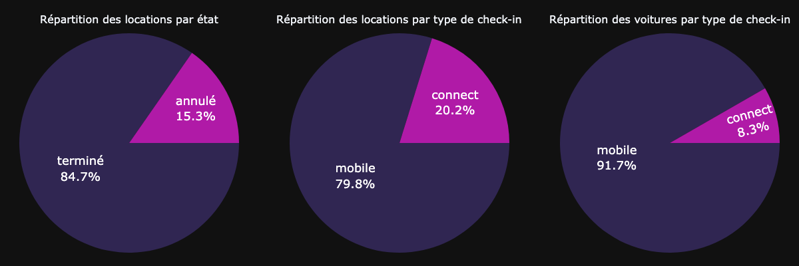
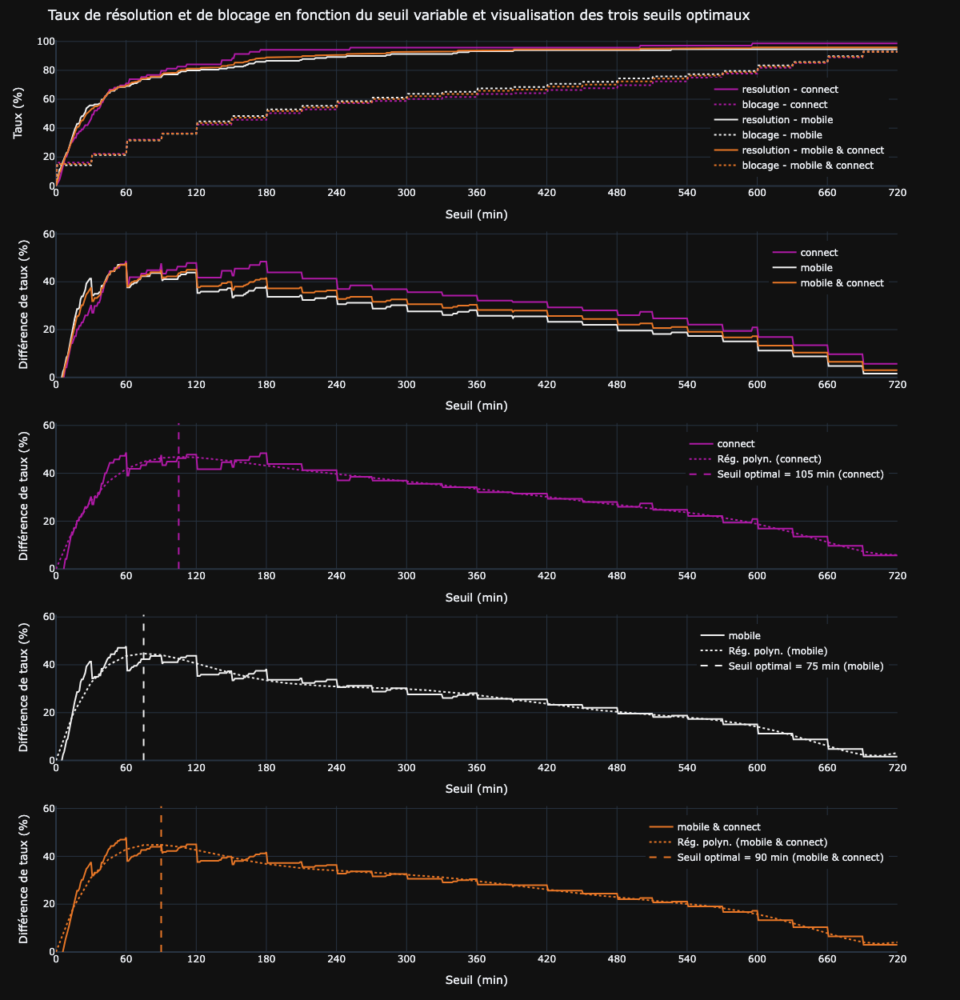
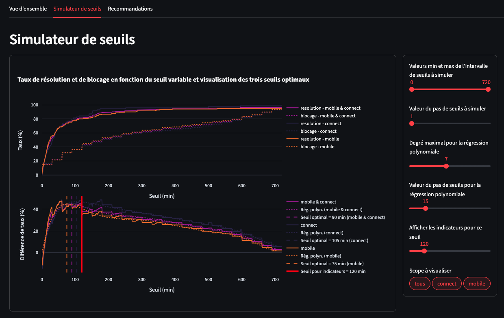
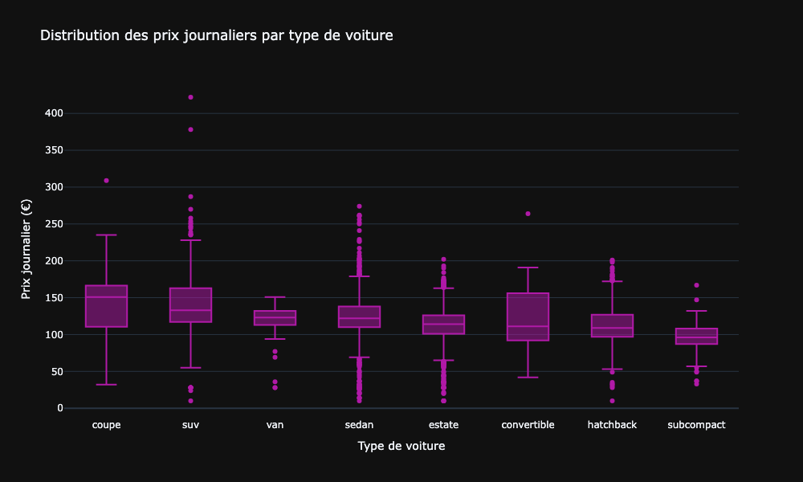
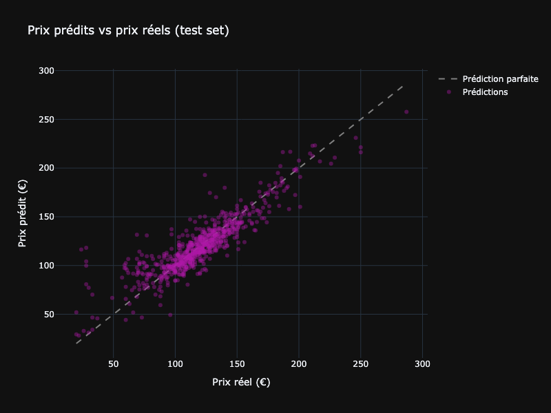
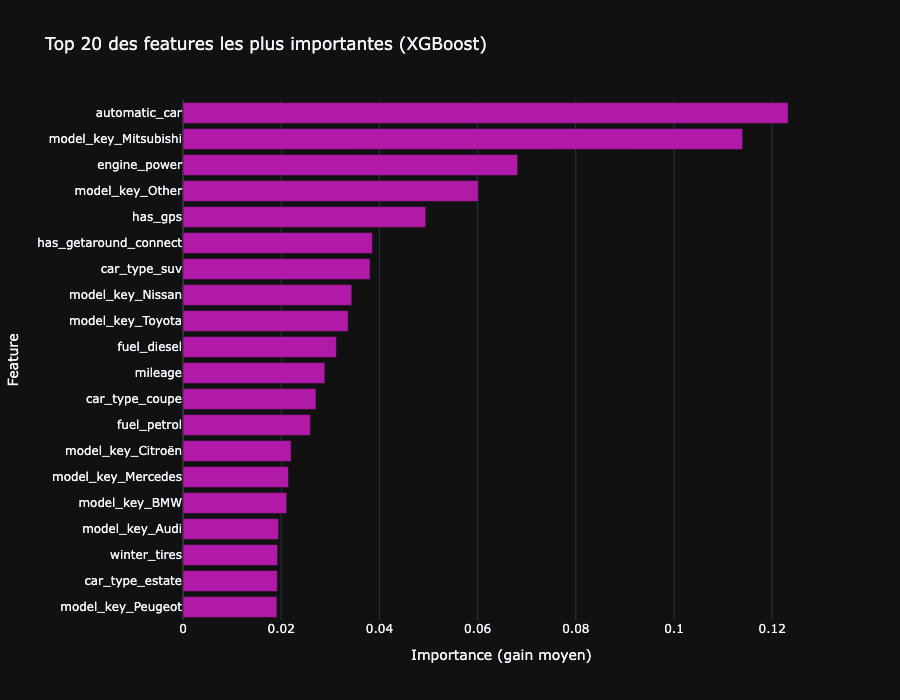

# Getaround Analysis : recommander un seuil entre locations et prédire le prix journalier

<br><br>

<br><br>

> Projet de mise en production · Certification CDSD, bloc 5 · Auteur : **Yoann ROBERT**

Projet à deux volets adressant deux décisions opérationnelles de Getaround. 
Le premier volet détermine, par l'analyse de la friction entre locations consécutives, le seuil de 
délai minimum optimal à introduire entre deux locations d'un même véhicule, restitué dans un dashboard 
interactif avec simulateur. Le second volet entraîne un modèle XGBoost de prédiction du prix journalier 
de location à partir des caractéristiques d'un véhicule, suivi via MLflow et servi en production via 
une API FastAPI.

## Contexte et problématique

[Getaround](https://www.getaround.com) est l'équivalent d'Airbnb pour les voitures, fondée en 2009 et 
comptant plus de 5 millions d'utilisateurs et environ 20 000 véhicules disponibles dans le monde. 
Deux problématiques opérationnelles sont étudiées :

- **Retards au check-out et friction induite.** 
Lorsqu'un conducteur rend son véhicule en retard, la location suivante en pâtit (mécontentement, 
voire annulation). Pour limiter la friction, Getaround envisage d'introduire un délai minimum entre 
deux locations consécutives d'un même véhicule. Reste à choisir le seuil et le périmètre 
d'application : toutes les voitures ou seulement celles équipées du dispositif Connect.
- **Optimisation tarifaire pour les propriétaires.** 
Les propriétaires fixent eux-mêmes le prix journalier de leur véhicule, sans nécessairement disposer 
d'un outil d'aide à la décision. L'équipe data science souhaite proposer une recommandation tarifaire 
basée sur les caractéristiques objectives du véhicule, exposée via une API consommable par les 
applications internes.

## Livrables déployés

Quatre artefacts sont produits et hébergés sur Hugging Face Spaces :

| Artefact                                  | Description                                                                 | Lien                                                                                                                     |
|-------------------------------------------|-----------------------------------------------------------------------------|--------------------------------------------------------------------------------------------------------------------------|
| **Dashboard d'analyse des délais**        | Interface interactive incluant un simulateur de seuils paramétrable         | [getaround-delay-analysis.hf.space](https://yoannrobert-getaround-delay-analysis.hf.space/)                              |
| **Serveur MLflow**                        | Suivi des expériences et registre de modèles (protégé par authentification) | [mlflow-getaround.hf.space](https://yoannrobert-mlflow-getaround.hf.space/)                                              |
| **API de prédiction des prix**            | Endpoint FastAPI consommant le modèle promu en production via MLflow        | [fastapi-getaround-price-prediction.hf.space/docs](https://yoannrobert-fastapi-getaround-price-prediction.hf.space/docs) |
| **Notebook d'analyse et de modélisation** | Démarche complète, de l'EDA à l'enregistrement du modèle en registry        | `notebooks/Getaround.ipynb`                                                                                              |

## Données

Deux jeux de données distincts sont utilisés selon le volet :

| Volet 1 : Analyse des délais   |                                                                                                                                             |
|--------------------------------|---------------------------------------------------------------------------------------------------------------------------------------------|
| **Fichier**                    | `get_around_delay_analysis.xlsx`                                                                                                            |
| **Volume**                     | 21 310 locations                                                                                                                            |
| **Granularité**                | Une ligne = une location                                                                                                                    |
| **Variables clés**             | `state` (terminé / annulé), `checkin_type` (mobile / connect), `delay_at_checkout_in_minutes`, `time_delta_with_previous_rental_in_minutes` |

| Volet 2 : Prédiction de prix   |                                                                                                                                                                    |
|--------------------------------|--------------------------------------------------------------------------------------------------------------------------------------------------------------------|
| **Fichier**                    | `get_around_pricing_project.csv`                                                                                                                                   |
| **Volume**                     | 4843 véhicules                                                                                                                                                     |
| **Granularité**                | Une ligne = un véhicule                                                                                                                                            |
| **Variables explicatives**     | `model_key` (marque), `mileage`, `engine_power`, `fuel`, `paint_color`, `car_type`, 6 options booléennes (`has_gps`, `automatic_car`, `has_air_conditioning`, ...) |
| **Cible**                      | `rental_price_per_day` (prix journalier en euros)                                                                                                                  |



## Démarche

L'étude est conduite dans un notebook unique structuré en deux volets, suivis chacun de leur 
industrialisation.

**Volet 1 : Analyse des délais (parties 1 à 4)**

1. **Chargement des données.** 
Lecture du fichier Excel et de sa documentation, contrôle des types et des valeurs manquantes.
2. **Analyse exploratoire.** 
Répartition des locations par état et par type de check-in, distribution des délais au check-out, 
identification des locations consécutives (intervalle inférieur à 12 heures), caractérisation de la 
friction (location consécutive précédée d'un retard supérieur au délai disponible) et son impact 
sur les annulations.
3. **Recherche du seuil optimal.** 
Simulation sur l'intervalle 0-720 minutes des taux de résolution (proportion des cas de friction 
évités) et de blocage (proportion des locations consécutives empêchées), pour trois périmètres 
d'application (connect uniquement, mobile uniquement, ensemble du parc). Lissage par régression 
polynomiale pour identifier précisément les optima. Évaluation des coûts (locations bloquées, revenus 
impactés) et des bénéfices (cas de friction résolus) en fonction du seuil.
4. **Recommandation finale.** 
Choix d'un seuil opérationnel et d'un périmètre d'application argumenté sur trois critères 
(faisabilité technique, coût mesuré, stratégie d'apprentissage incrémentale).

**Volet 2 : Prédiction du prix journalier (parties 5 à 12)**

5. **Chargement des données.** 
Lecture du CSV, contrôle des types et statistiques descriptives.
6. **Analyse exploratoire orientée prix.** 
Distribution de la cible, prix médians par marque (28 marques dont 5 concentrant 80% du parc), par 
type de véhicule, par carburant et par option, corrélations avec les variables continues (puissance 
moteur, kilométrage).
7. **Mise en place du pipeline ML.** 
Nettoyage des aberrations logiques, regroupement des marques rares sous une modalité `Other`, split 
70/15/15 train/validation/test, `ColumnTransformer` associant `StandardScaler` pour les variables 
numériques et `OneHotEncoder` pour les catégorielles.
8. **Développement de trois candidats.** 
Régression linéaire comme baseline, forêt aléatoire et XGBoost. Chaque modèle est encapsulé dans un 
`Pipeline` scikit-learn et tracé dans un run MLflow avec ses métriques (MAE, RMSE, R²) sur 
entraînement et validation.
9. **Comparaison et sélection.** 
Tableau comparatif des trois modèles, sélection sur la RMSE de validation (pénalisation plus forte 
des grosses erreurs, pertinente sur une cible asymétrique).
10. **Optimisation des hyperparamètres.** 
`RandomizedSearchCV` sur le candidat retenu, 30 itérations en validation croisée à 5 plis, sélection 
des paramètres minimisant la RMSE de validation.
11. **Évaluation finale et mise en production.** 
Réentrainement sur `train + validation`, évaluation sur le jeu de test isolé, enregistrement dans le 
**MLflow Model Registry** avec signature et exemple d'entrée, puis promotion via l'alias 
`production` consommable par l'API.
12. **Conclusion.** 
Synthèse des performances et lecture croisée entre importances XGBoost et déterminants identifiés en 
EDA.

## Principaux résultats

### Volet 1 : seuil de délai entre locations

**Le constat central : la friction est un phénomène concentré, qui peut être très efficacement traité 
sur un sous-périmètre.** Seules 1,02% des locations connaissent un cas de friction, mais elles 
représentent un point dur opérationnel : leur taux d'annulation atteint 17,0% contre 15,3% en moyenne. 
La friction est sur-représentée sur le check-in connect (31,7% des cas de friction pour 20,2% des 
locations), qui est aussi le périmètre techniquement le plus simple à instrumenter (blocage automatique 
dans le moteur de réservation).

La simulation balaie l'ensemble des seuils entre 0 et 720 minutes, calcule pour chacun le taux de 
résolution et le taux de blocage, et localise les trois optima par lissage polynomial. Le pic de 
différence entre les deux taux se situe entre 75 et 105 minutes selon le périmètre.



La recommandation finale, **un déploiement en deux phases**, est défendue dans le notebook puis 
restituée dans le dashboard via un onglet de simulation paramétrable. L'utilisateur peut faire varier 
l'intervalle de seuils balayés, le degré du lissage polynomial et le périmètre visualisé, et lire en 
direct les indicateurs (cas de friction résolus, locations bloquées, revenus impactés) pour le seuil 
de son choix.



| Indicateur du seuil retenu                     | Valeur                           |
|------------------------------------------------|----------------------------------|
| Seuil optimal mathématique (connect)           | 1 h 45 min                       |
| **Seuil retenu (phase 1, connect uniquement)** | **120 min**                      |
| Cas de friction connect résolus                | ~80%                             |
| Part de la friction totale résolue             | ~25%                             |
| Locations consécutives connect bloquées        | ~36%                             |
| Locations connect bloquées (en absolu)         | 295 (1,4% du total)              |
| Pour comparaison, déploiement global immédiat  | 666 bloquées (3,1% du total)     |

### Volet 2 : prédiction du prix journalier

**Le constat central : trois leviers dominent le prix, et XGBoost en tire une précision opérationnelle 
solide.** L'EDA met en évidence une cible asymétrique à droite (médiane 119€, queue premium s'étirant 
jusqu'à 422€), un effet puissance moteur très net (corrélation 0,63), un effet de gamme par marque 
allant du simple au double, et six options à effet positif net sur le prix médian (boîte automatique 
+29€, Connect +20€, GPS +19€, climatisation +16€, régulateur de vitesse +14€, place de parking +14€).



XGBoost domine les deux autres candidats sur l'ensemble des métriques de validation, et reste devant 
après optimisation des hyperparamètres :

| Modèle                          | MAE val     | RMSE val    | R² val     |
|---------------------------------|-------------|-------------|------------|
| Régression linéaire (baseline)  | 12,28€      | 18,32€      | 0,693      |
| Forêt aléatoire                 | 11,10€      | 17,65€      | 0,715      |
| XGBoost (défaut)                | 10,67€      | 16,92€      | 0,738      |
| **XGBoost (tuné)**              | **10,48€**  | **16,81€**  | **0,742**  |

Le réentraînement final sur `train + validation` puis l'évaluation sur le test set isolé donnent une 
performance **en amélioration** par rapport à la validation, signe d'une bonne généralisation :
**MAE 10,30€** (~8,7% d'erreur relative rapportée à la médiane de 119€), **RMSE 15,13€**, 
**R² 0,790**. En termes opérationnels, **64,6% des prédictions sont à moins de 10€ de la valeur 
réelle** et **86,9% à moins de 20€**.



Le diagnostic des résidus confirme l'absence de biais systématique (moyenne -0,50€, médiane 1,43€) et 
révèle une asymétrie marquée vers la gauche (skewness -1,50) : les erreurs les plus importantes sont 
des **surestimations sur les véhicules d'entrée de gamme**, sous-représentés dans le dataset. Cette 
faiblesse est documentée mais reste périphérique au cas d'usage principal.

Les importances XGBoost confirment et précisent les déterminants identifiés à l'EDA : la boîte 
automatique arrive en tête, la puissance moteur est en 3ᵉ position, la marque est massivement 
représentée (9 des 20 premières features), et la couleur de carrosserie est totalement absente du top 
20, conformément à l'attente métier.



Le modèle est enregistré dans le MLflow Model Registry sous le nom `getaround-pricing` et promu via 
l'alias `production`. L'API FastAPI le consomme par l'URI `models:/getaround-pricing@production`, ce 
qui boucle la chaîne EDA → modélisation → mise en production.

## Recommandations pour Getaround

**Sur le seuil de délai entre deux locations consécutives :**

- **Déploiement en deux phases.** 
Phase 1 (immédiate) : seuil de 120 minutes appliqué au check-in connect uniquement, où le blocage 
automatique est trivial à implémenter dans le moteur de réservation. Phase 2 (conditionnelle, après 
3 à 6 mois d'observation) : extension au check-in mobile avec éventuel ajustement du seuil.
- **Justification du périmètre restreint à connect.** 
Trois critères convergents. Faisabilité technique : connect est nativement digital, mobile repose 
sur une rencontre humaine et exige des développements complémentaires. Coût mesuré : 1,4% des 
locations bloquées contre 3,1% pour un déploiement global, soit environ deux fois moins de revenus 
impactés. Apprentissage incrémental : tester sur un périmètre restreint avant de généraliser.
- **Justification du seuil de 120 minutes.** 
Ce seuil dépasse légèrement l'optimum mathématique pour connect (1 h 45 min), mais offre une zone de 
tolérance d'environ ±30 minutes sans perte notable de performance. Il s'inscrit dans la loi des 
80-20 : ~80% des cas de friction connect résolus pour ~36% des locations consécutives connect 
bloquées.
- **Mesurer l'impact en production.** 
Un test A/B sur la phase 1 permettra de mesurer l'impact effectif sur le chiffre d'affaires des 
propriétaires et la satisfaction utilisateur, avant toute décision d'extension.

**Sur la prédiction de prix :**

- **Intégrer l'API dans l'interface propriétaire.** 
Le modèle atteint une précision opérationnelle confortable (~8,7% d'erreur relative médiane) et 
peut être proposé comme **suggestion** lors de la mise en ligne d'un véhicule, le propriétaire 
restant libre de l'ajuster.
- **Documenter le périmètre de validité.** 
Le modèle est moins fiable sur les véhicules d'entrée de gamme (surestimation systématique, 
sous-représentation dans le jeu d'entraînement). Une indication de confiance contextuelle ou une 
règle simple de plafond bas pourrait accompagner l'output.
- **Mettre en place un suivi de dérive.** 
Le marché évolue (inflation, mix produit, comportements). Un suivi de la distribution des features 
en entrée et de la distribution des écarts entre prix suggéré et prix appliqué par les 
propriétaires permettra de déclencher un ré-entrainement périodique.

## Architecture de déploiement

L'infrastructure repose sur trois services Hugging Face Spaces indépendants, articulés autour d'un 
**MLflow Model Registry** centralisé pour la gestion du cycle de vie du modèle.

```
┌──────────────────────────────────────────────────────────────────────┐
│                      DEVELOPPEMENT (local)                           │
│             notebook Jupyter · pandas · scikit-learn · XGBoost       │
└──────────────────────────────┬───────────────────────────────────────┘
                               │ log + register
                               ▼
┌──────────────────────────────────────────────────────────────────────┐
│      MLflow Tracking Server + Model Registry (HF Space)              │
│      Backend : Neon PostgreSQL · Artifacts : AWS S3                  │
│      Modèle : "getaround-pricing" · alias : "production"             │
└──────────┬───────────────────────────────────────────────────────────┘
           │ models:/getaround-pricing@production
           ▼
┌────────────────────────────────────┐   ┌────────────────────────────┐
│      API FastAPI (HF Space)        │   │   Dashboard (HF Space)     │
│       POST /predict · GET /        │   │   Vue d'ensemble           │
│       OpenAPI auto-générée         │   │   Simulateur de seuils     │
│                                    │   │   Recommandations          │
└────────────────────────────────────┘   └────────────────────────────┘
```

**Choix d'hébergement.** Hugging Face Spaces a été retenu pour les trois services en raison de sa 
simplicité de déploiement (build et serve automatiques à partir d'un Dockerfile ou d'un fichier 
`requirements.txt`), de son intégration native du versionnage Git, et de son free tier suffisant pour 
le périmètre du projet. Les artefacts MLflow sont stockés sur AWS S3 plutôt qu'en local, ce qui permet 
au Space MLflow de redémarrer sans perdre l'historique des runs.

**Sécurité.** Le serveur MLflow est protégé par authentification basique (HTTP basic auth via 
variables d'environnement). Les credentials du registry ne sont jamais commités : ils sont injectés 
au démarrage de chaque service via les secrets Hugging Face.

## Structure du projet

```
.
├── .env.example                       # template des variables d'environnement
├── Getaround_analysis_Guidelines.md   # consignes données par Jedha
├── README.md                          # ce fichier
├── requirements.txt                   # dépendances Python du notebook
├── images                             # visualisations exportées (PNG)
├── notebooks/Getaround.ipynb          # notebook complet
└─── spaces
          ├── api                      # service FastAPI
          ├── dashboard                # service dashboard
          └── mlflow                   # service MLflow
```

## Installation et exécution

Prérequis :
- Python 3.10+
- Un compte AWS (accès S3) pour les artefacts MLflow
- Une base PostgreSQL accessible (Neon free tier ou équivalent) pour le backend MLflow

```bash
pip install -r requirements.txt
```

**Configuration des credentials.** Renseigner un fichier `.env` à la racine, sur le modèle de 
`.env.example`, contenant :

- `MLFLOW_TRACKING_URI` : URI publique du serveur MLflow
- `MLFLOW_TRACKING_USERNAME`, `MLFLOW_TRACKING_PASSWORD` : authentification au serveur
- `AWS_ACCESS_KEY_ID`, `AWS_SECRET_ACCESS_KEY` : credentials S3 pour les artefacts

Le notebook lit les jeux de données directement depuis les URL publiques fournies par Jedha, aucun 
téléchargement manuel n'est nécessaire. Il suffit d'ouvrir le notebook et d'exécuter les cellules dans 
l'ordre. L'enregistrement du modèle dans le MLflow Model Registry suppose un serveur MLflow déjà 
provisionné et accessible.

Deux drapeaux en tête de notebook contrôlent les sorties : `SHOW_INTERACTIVE_FIG` affiche les figures 
Plotly en mode interactif, et `EXPORT_IMG` régénère les exports PNG. L'export statique des figures 
Plotly repose sur `kaleido`. Sur certaines installations récentes, une étape supplémentaire est 
nécessaire pour installer une version embarquée de Chrome/Chromium :

```bash
kaleido_get_chrome      # ou, de façon équivalente : plotly_get_chrome
```

Sans cette étape, tout appel à `fig.write_image(...)` échoue avec une erreur du type 
`Kaleido requires Google Chrome to be installed`. Le notebook fonctionne en mode purement interactif 
sans cette étape, qui n'est requise que pour régénérer les PNG.

**Déploiement des trois services.** Chaque sous-dossier (`api`, `dashboard`, `mlflow`) contient 
son propre `Dockerfile` et sa propre configuration.
Par défaut, sur Hugging Face Spaces, un déploiement se fait par push direct du sous-dossier sur le dépôt 
Git associé au Space, les secrets étant configurés dans l'interface du Space.
Ici, une GitHub Action a été mise en place.
À chaque commit poussé sur le dépôt du projet, l'action précédente est effectuée automatiquement depuis GitHub.

## Limites

Résultats à lire avec prudence méthodologique et opérationnelle :

1. **Causes des annulations non renseignées.** 
Les 15,3% de locations annulées ne comportent pas de motif explicite. Une partie pourrait être 
directement liée à la friction, auquel cas le gain réel de la mesure de seuil dépasserait l'estimation 
fondée uniquement sur les cas de friction observés.
2. **Optimum mathématique versus optimum métier.** 
Les seuils optimaux sont obtenus par optimisation numérique au quart d'heure près. Les courbes 
montrent que la performance reste quasi constante sur des intervalles d'environ ±30 minutes autour 
des optima : le choix exact doit intégrer une vision métier (lisibilité du chiffre rond, contraintes 
opérationnelles) que la pure optimisation ne capture pas.
3. **Modèle de pricing entraîné sur un instantané.** 
Le dataset reflète un état du marché à un moment donné. Le prix médian, le mix de marques et les 
préférences sur les options évoluent dans le temps. Un suivi de dérive et un ré-entrainement 
périodique sont indispensables en production.
4. **Sous-représentation du segment bas de gamme.** 
Le modèle surestime systématiquement les véhicules d'entrée de gamme (queue gauche des résidus très 
étendue, jusqu'à -92€). Soit le dataset doit être enrichi sur ce segment, soit l'API doit signaler 
explicitement une moindre fiabilité dans cette plage.
5. **Couleur exclue à juste titre, mais sur la base d'un effet marginal.** 
La couleur de carrosserie n'apparaît pas dans le top 20 des importances, en cohérence avec l'EDA. Ce 
résultat reflète peut-être autant l'absence d'effet réel qu'un mix de couleurs trop concentré dans le 
dataset pour révéler un signal subtil.
6. **Architecture sur free tier.** 
L'infrastructure (HF Spaces, Neon, S3 free tier) suffit largement au périmètre du projet, mais ne 
préjuge pas du comportement à charge réelle. Une mise en production effective impliquerait de 
dimensionner les services, de mettre en place un monitoring et une alerting, et de durcir les accès 
au serveur MLflow.

## Stack technique

Python · pandas · NumPy · scikit-learn · XGBoost · MLflow (tracking + registry) · FastAPI · Plotly · 
Hugging Face Spaces · Docker · AWS S3 · Neon PostgreSQL